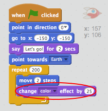

## Animating using loops

Toinen tapa animoida avaruusalus on kertoa se siirtää pieni määrä paljon aikaa.

+ Poista `liuku` lohko koodista napsauttamalla sitä hiiren kakkospainikkeella ja napsauttamalla **poista**. Voit myös poistaa koodin vetämällä sen pois komentosarja-alueesta ja takaisin koodilohkojen alueelle.
    
    

+ Voitteko käyttää `toista` estää siirtää avaruusalustasi kohti maata?
    
    Testaa ja säästää: Sinun avaruusalustesi tulisi liikkua maan päällä aivan kuten aikaisemmin, tällä kertaa `toistuvilla` -lohkoilla.
    
    

\--- vinkit \--- \--- vinkka \--- **liukuvan**sijasta avaruusalustasi **toistuvasti** **siirrä** muutama vaihe kerrallaan. \--- / hint \--- \--- vinkki \--- Tässä on tarvittavat koodilohkot:  \--- / hint \--- \--- vinkka \--- Tässä on koodi animoida sinun avaruusalus:  ( `toista` ja `siirrä` lohkoja eri numeroilla, kunhan avaruusalus saa yhä maapallon!) \--- / hint \--- \--- / vinkkejä \---

+ Voitteko koodata avaruusalustasi vaihtaa väriä, kun se liikkuu kohti maata?
    
    Testaa ja tallenna.
    
    

\--- vinkit \--- \--- vinkka \--- Sinun avaruusalustasi pitäisi **vaihtaa väriä** , kun se liikkuu. \--- / hint \--- \--- vinkki \--- Tässä on ylimääräinen koodilohko, jota tarvitset:  \--- / hint \--- \--- vinkki \--- Tässä on koodi muuttaa avaruusaluksen värin :  \--- / hint \--- \--- / vinkit \---

+ Voitteko tehdä avaruusalustasi pienemmän, kun se tulee maapallolle?
    
    Testaa ja tallenna. Sinun avaruusaluksen pitäisi olla pienempi, kun se liikkuu. Testaa avaruusalus **sekunnin**. Onko se oikea koko, kun se alkaa?
    
    

\--- vinkit \--- \--- vinkka \--- Sinun avaruusalus tulisi aloittaa **100% koko**ja sitten **muuttaa kokoa** pienellä määrällä, kun se liikkuu. \--- / hint \--- \--- vinkki \--- Tässä on tarvittavat koodilohkot:  \--- / hint \--- \--- vinkki \--- Tässä on koodi, jolla muutat avaruusalustasi kokoa se liikkuu:  \--- / hint \--- \--- / vinkkejä \---