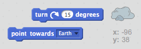

## Bouncing asteroid

Lisätään jokin kelluva avaruuskalli animaatioihisi.

+ Lisää "rock" sprite animaatiostasi.
    
    

+ Voitko koodata rock-spriteäsi pomppimaan lavan ympäri?
    
    

\--- vinkit \--- \--- vinkki \--- Kun vihreä **lippu napsautetaan**, sinun rock sprite on **siirrettävä** ja **ponnahtaa** lavan **ympärille ikuisesti**. \--- / hint \--- \--- vinkki \--- Seuraavassa on tarvittavia koodilohkoja:  Voit myös asettaa mielenkiintoisemman kallistuksen aloitussuuntaa jollakin näistä lohkoista:  \--- / hint \--- \--- vinkki \--- Tässä on koodi pyöräytä kalliosi ympäri vaiheessa:  \--- / hint \--- \--- / vinkkejä \---