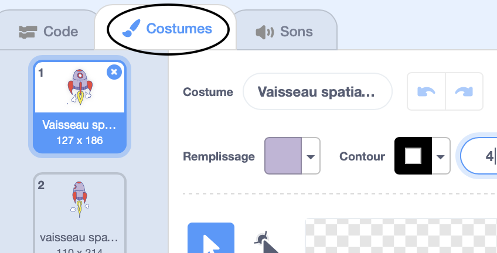
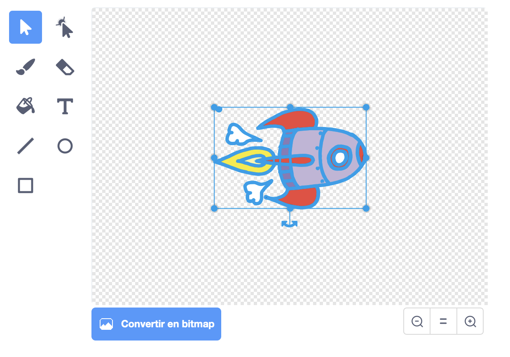

## Les lutins

+ Tout d'abord, assurez-vous d'avoir ouvert l'éditeur Scratch. Vous pouvez le trouver en ligne à l'adresse <a href="http://jumpto.cc/scratch-new">jumpto.cc/scratch-new</a>. Il devrait ressembler à ceci :

	

+ Avant de pouvoir coder votre animation, il vous faut un 'objet' à animer. Dans Scratch, ces 'objets' sont appelés 'lutins'. Le chat que vous pouvez voir est un lutin nommé Félix. C'est la mascotte de Scratch, mais débarrassons-nous de lui pour l'instant. Cliquez sur Felix avec le bouton droit de la souris, puis choisissez 'supprimer'.

	

+ Cliquez ensuite sur l'icône 'Choisir un lutin dans la bibliothèque' pour voir tous les lutins qui sont fournis avec Scratch.

	

+ Faites défiler les images jusqu'à ce que vous trouviez un vaisseau spatial. Cliquez dessus pour le sélectionner, puis cliquez sur 'OK' pour l'ajouter à votre animation.

	

+ Cliquez sur votre nouveau vaisseau spatial dans la zone 'Lutins' en bas à gauche, puis allez dans l'onglet 'Costumes' à droite.

	

+ Utilisez l'outil flèche pour sélectionner toute l'image. Puis cliquez et tirez sur la poignée de rotation pour faire tourner la fusée sur ​​le côté.

	

+ Vous devriez maintenant avoir un grand vaisseau spatial sur votre 'scène'. La 'scène' est la zone en haut à gauche. C'est là que votre animation va se dérouler, c'est comme une vraie scène de théatre ! Vous pouvez faire glisser le vaisseau spatial autour de la scène pour le déplacer.

	Pour l'instant, votre scène est blanche et bien ennuyeuse ! Ajoutez-y une toile de fond : Allez dans l'onglet​ 'Arrière-plans' de la scène, puis cliquez sur l'icône 'Choisir un arrière-plan dans la bibliothèque'.

	

+ Cliquez sur la catégorie 'Espace' à gauche, puis choisissez l'arrière-plan étoilé qui s'appelle 'stars'. Cliquez sur 'OK' pour l'ajouter à votre scène.

	

	Votre scène devrait maintenant ressembler à cela :

	

--- challenge ---
## Défi : Ajoutez un autre lutin
Pouvez-vous ajouter un nouveau lutin (la Terre) à votre scène, pour que ça ressemble à ceci ?

--- /challenge ---

Pour ne pas perdre votre travail, vous devez l'enregistrer régulièrement. Tout d'abord, donnez un nom à votre animation : tapez-le dans la zone texte au dessus de la scène. Vous pouvez ensuite cliquer sur 'Fichier' puis 'Sauvegarder maintenant' pour enregistrer votre projet.

Si vous utilisez Scratch en ligne, tout ce que vous sauvegardez est ajouté à vos 'projets'. C'est un dossier en ligne auquel vous pouvez accéder de n'importe où, même de chez vous. Vous pouvez accéder à ce dossier en cliquant sur 'Fichier', puis 'Aller à mes projets'.

Ceci vous donne la liste de tous vous projets. Cliquez sur 'Voir à l'intérieur' pour continuer de programmer votre animation.

Si vous utilisez Scratch en ligne mais que vous n'avez pas de nom d'utilisateur, vous pouvez cliquer sur 'Télécharger dans votre ordinateur' pour sauvegarder votre projet sur votre ordinateur.
