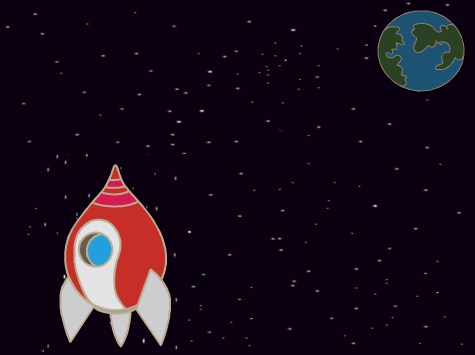

## Animer un vaisseau spatial

Ton premier objectif sera de créer un vaisseau spatial qui vole vers la Terre!

\--- task \---

Ouvre un nouveau projet Scratch.

** En ligne :** ouvre un nouveau projet Scratch en ligne à [rpf.io/scratch-new](http://rpf.io/scratchon){:target="_blank"}.

**Hors ligne:** ouvre un nouveau projet dans l'éditeur hors ligne.

Si tu dois télécharger et installer l'éditeur hors ligne Scratch, tu peux le trouver à [rpf.io/scratchoff](http://rpf.io/scratchoff){:target="_blank"}.

\--- /task \---

\--- task \---

Add 'rocketship' and 'Earth' sprites to your Stage.


[[[generic-scratch3-sprite-from-library]]]

\--- /task \---

\--- task \---

Add the 'Stars' backdrop to your Stage.



\--- /task \---

\--- task \---

Click on your spaceship sprite, and click on the **Costumes** tab.


\--- /task \---

\--- task \---

Use the **arrow** tool to click and drag a box around the whole spaceship image. Then click on the circular **rotate** handle, and rotate the image until it is on its side.


\--- /task \---

\--- task \---

Add this code to your spaceship sprite:


```blocks3
quand le drapeau vert pressé
s'orienter en direction de (0)
aller à x: (-150) y: (-150)
dire [c'est parti !] pendant (2) secondes
s'orienter vers (Earth v)
glisser en (1) secondes à x: (0) y: (0)
```

Change the numbers in the code blocks you've added so that the code is exactly the same as above.

\--- /task \---

If you click the green flag, you should see the spaceship speak, turn, and glide towards the centre of the stage.

