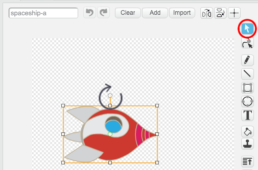

## Animer un vaisseau spatial

Votre première étape sera de créer un vaisseau spatial qui vole vers la Terre!

\--- task \---

Ouvrez un nouveau projet Scratch.

**En ligne:** ouvre un nouveau projet Scratch en ligne à [rpf.io/scratchon](http://rpf.io/scratchon){: target = "_ blank"}.

**Hors ligne:** ouvre un nouveau projet dans l'éditeur hors ligne.

Si vous devez télécharger et installer l'éditeur hors ligne Scratch, vous pouvez le trouver à l'adresse [rpf.io/scratchoff](http://rpf.io/scratchoff){: target = "_ blank"}.

\--- /task \---

\--- task \--- Ajoutez les sprites 'rocketship' et 'Earth' à votre scène.


[[[generic-scratch3-sprite-from-library]]]

\--- /task \---

\--- task \--- Ajoutez le fond 'Stars' à votre scène.


\--- /task \---

\--- task \--- Cliquez sur votre sprite de vaisseau spatial, puis sur l'onglet **Costumes**.


\--- /task \---

\--- task \--- Utilisez l'outil **flèche** pour cliquer et faire glisser une zone autour de l'image du vaisseau spatial. Cliquez ensuite sur la poignée circulaire **rotation** et faites pivoter l'image jusqu'à ce qu'elle soit sur le côté.



\--- /task \---

\--- task \--- Ajoutez ce code à votre sprite de vaisseau spatial:


```blocks3
lorsque le drapeau est cliqué
point en direction (0)
aller à x: (- 150) y: (- 150)
dire [Allons-y] pendant (2) secondes
points en direction de (Terre v)
glisse (1) seconde à x: (0) y: (0)
```

Modifiez les numéros dans les blocs de code que vous avez ajoutés pour que le code soit exactement le même que ci-dessus.

\--- /task \---

Si vous cliquez sur le drapeau vert, vous devriez voir le vaisseau parler, tourner et glisser vers le centre de la scène.

