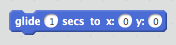

## Animer un vaisseau spatial

Créons un vaisseau spatial qui défendra la Terre!

+ Ouvrez un nouveau projet Scratch vide.

[[[generic-scratch-new-project]]]

+ Ajoutez des lutins «vaisseau spatial» et «Terre» à votre scène.
    
    

[[[generic-scratch-sprite-from-library]]]

+ Ajoutez l'arrière plan "Stars" à votre scène.
    
    

[[[generic-scratch-backdrop-from-library]]]

+ Cliquez sur l'image-objet de votre vaisseau spatial et cliquez sur l'onglet ** Costumes **.
    
    

+ Use the **arrow** tool to select the image. Then click on the circular **rotate** handle, and rotate the image until it is on its side.
    
    

+ Add this code to your spaceship sprite:
    
    
    
    Change the numbers in the code blocks so that the code is exactly the same as in the image above.
    
    If you click the green flag, you should see the spaceship speak, turn, and glide towards the centre of the stage.
    
    

[[[generic-scratch-saving]]]

\--- challenge \---

## Challenge: improving your animation

Can you change the numbers in your animation code, so that:

+ The spaceship moves until it touches the Earth?
+ The spaceship moves more slowly towards the Earth?

You'll need to change the numbers in this block:

[[[generic-scratch-coordinates]]]

\--- /challenge \---