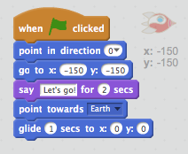

## Animez vos lutins

Maintenant que vous avez quelques lutins, nous allons ajouter du code pour les animer !

+ Créons un script pour le vaisseau spatial, en utilisant des blocs de code. Vous pouvez trouver ces blocs dans l'onglet 'Scripts'. Ils ont tous un code de couleur ! Faites glisser les 2 blocs suivants dans la zone de code à droite, en vous assurant qu'ils sont bien attachés ensemble (comme des blocs Lego).

	

	Modifiez les chiffres dans les blocs de code, de façon à ce que le code soit exactement le même que dans l'image ci-dessus. Voici le code que vous devez ajouter :


	```blocks
		s'orienter vers [Earth v]
		glisser en (1) secondes à x:(0) y:(0)
	```

	Pour coder `s'orienter vers Earth`{:class="blockmotion"}, vous devez d'abord glisser et déposer le bloc de code, puis cliquer sur la petite flèche vers le bas pour choisir le lutin 'Earth'.

	

+ Si vous cliquez sur ces blocs, le code sera exécuté : Vous devriez voir le vaisseau spatial tourner et se déplacer vers le centre de la scène.

	

	La position sur l'écran `x:(0) y:(0)`{:class="blockmotion"} est le centre de la scène. Une position comme `x:(-150) y:(-150)`{:class="blockmotion"} est située presque tout en bas et à gauche de la scène. Et une position comme `x:(150) y:(150)`{:class="blockmotion"} est près du haut droit de la scène.

	

	Si vous voulez connaître les coordonnées d'un endroit sur la scène, mettez la souris à la position souhaitée, puis notez les coordonnées qui sont affichées sous la scène.

	

+ Si vous essayez de cliquer à nouveau sur le code pour l'exécuter une seconde fois, rien ne se passe ! C'est parce que le vaisseau est déjà arrivé là où on lui a dit d'aller. Améliorons votre animation : Demandons au vaisseau de toujours commencer en bas à gauche de la scène, et faisons-le pointer vers le haut.

+ Ajoutez quelques blocs à votre animation, devant les blocs que vous avez déjà. Votre code devrait maintenant ressembler à ceci :

	```blocks
		s'orienter à (0 v)
		aller à x:(-150) y:(-150)
		attendre (1) secondes
		s'orienter vers [Earth v]
		glisser en (1) secondes à x:(0) y:(0)
	```

	Vous trouverez le bloc `attendre (1) secondes`{:class="blockcontrol"} en cliquant sur la section orange `Contrôle`{:class="blockcontrol"}.

+ Votre vaisseau spatial se déplace maintenant _chaque fois_ que vous exécutez votre code. Essayez-le !

+ Vous pouvez également attacher vos blocs de code à un 'événement'. Cela signifie que le code s'exécutera lorsque quelque chose se passera : par exemple lorsque vous cliquez sur le drapeau vert, lorsque vous appuyez sur une touche ou lorsque vous cliquez sur un lutin.

	

	Faites glisser un événement au tout début de votre code, pour que l'animation démarre lorsque vous cliquez sur le drapeau vert. Votre code devrait ressembler à ceci:


	```blocks
		quand le drapeau vert pressé
		s'orienter à (0 v)
		aller à x:(-150) y:(-150)
		attendre (1) secondes
		s'orienter vers [Earth v]
		glisser en (1) secondes à x:(0) y:(0)
	```

+ Essayez votre animation à plusieurs reprises, en cliquant sur le drapeau vert juste au-dessus de la scène.

	

--- challenge ---
## Défi : Améliorez votre animation
Pouvez-vous modifier les chiffres dans le code de votre animation, pour que :
+ Le vaisseau spatial se déplace jusqu'à ce qu'il touche la Terre ?
+ Le vaisseau spatial se déplace plus lentement vers la Terre ?

Vous devrez changer les chiffres de ce bloc :

```blocks
	glisser en (1) secondes à x:(0) y:(0)
```
--- /challenge ---
