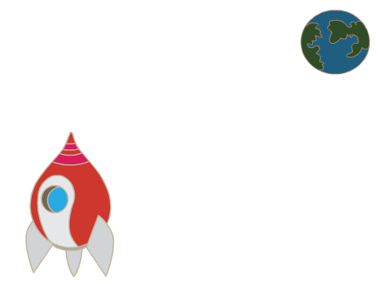

## Animer un vaisseau spatial

Créons un vaisseau spatial qui défendra la Terre!

+ Ouvrez un nouveau projet Scratch vide.

[[[generic-scratch-new-project]]]

+ Ajoutez des lutins «vaisseau spatial» et «Terre» à votre scène.
    
    

[[[generic-scratch-sprite-from-library]]]

+ Ajoutez l'arrière plan "Stars" à votre scène.
    
    

[[[generic-scratch-backdrop-from-library]]]

+ Cliquez sur l'image-objet de votre vaisseau spatial et cliquez sur l'onglet ** Costumes **.
    
    

+ Utilisez l'outil **flèche** pour sélectionner l'image. Puis cliquez sur la circulaire et faire pivoter l'image jusqu'à ce qu'elle soit de l'autre côté.
    
    

+ Ajoutez ce code à votre lutin de vaisseau spatial:
    
    
    
    Changez les nombres dans les blocs de code pour que le code soit exactement le même que dans l'image ci-dessus.
    
    Si vous cliquez sur le drapeau vert, vous devriez voir le vaisseau parler, tourner et glisser vers le centre de la scène.
    
    

[[[generic-scratch-saving]]]

\--- défi \---

## Défi: Animation améliorée

Pouvez-vous changer les chiffres dans votre code d'animation, de sorte que:

+ Le vaisseau spatial se déplace jusqu'à ce qu'il touche la Terre?
+ Le vaisseau spatial se déplace plus lentement vers la Terre?

Vous devrez changer les nombres dans ce bloc:

[[[generic-scratch-coordinates]]]

\--- /défi \---