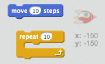
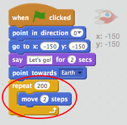
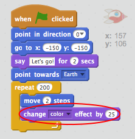
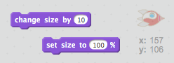
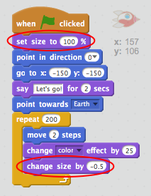

## Animez à l'aide de boucles

Une autre façon d'animer le vaisseau spatial est de lui dire de bouger un petit peu beaucoup de fois.

+ Supprimer le bloc de code glisser en cliquant dessus avec le bouton droit de la souris et en cliquant sur ** supprimer ** . Vous pouvez également supprimer le code en le faisant glisser hors de la zone Script et de nouveau dans la zone Blocs de code.
    
    

+ Pouvez-vous utiliser un bloc `répétition` pour déplacer votre vaisseau spatial vers la Terre?
    
    Testez et sauvegardez: votre vaisseau spatial devrait se déplacer exactement comme avant, mais en utilisant cette fois un bloc de `répétition`.
    
    

\--- astuces \--- \--- indice \--- Au lieu de ** glisser **, votre vaisseau spatial devrait ** à plusieurs reprises ** ** se déplacer ** quelques étapes à la fois. \--- /hint \--- \--- hint \--- Here are the code blocks you'll need:  \--- /hint \--- \--- hint \--- Here's the code to animate your spaceship:  (You can use different numbers in the `repeat` and `move` blocks, as long as the spaceship still gets to Earth!) \--- /hint \--- \--- /hints \---

+ Pouvez-vous coder votre vaisseau spatial pour qu'il change de couleur lorsqu'il se déplace vers la Terre?
    
    Tester et enregistrer.
    
    

\--- astuces \--- \--- indice \--- Votre vaisseau spatial devrait ** changer de couleur ** quand il bouge. \--- /hint \--- \--- hint \--- Here is the extra code block you'll need:  \--- /hint \--- \--- hint \--- Here's the code to change your spaceship's colour:  \--- /hint \--- \--- /hints \---

+ Pouvez-vous faire en sorte que la taille de votre vaisseau spatial diminue au fur et à mesure qu'il arrive sur Terre?
    
    Testez et enregistrez. Votre vaisseau spatial devrait devenir plus petit à mesure qu'il se déplace. Testez votre vaisseau spatial une ** seconde fois ** . Est-ce la bonne taille quand ça commence?
    
    

\--- astuces \--- \--- indice \--- Votre vaisseau devrait commencer à ** 100% taille ** , puis ** diminuez la taille ** progressivement quand il se déplace. \--- /hint \--- \--- hint \--- Here is the code blocks you'll need:  \--- /hint \--- \--- hint \--- Here's the code to change your spaceship's size as it moves:  \--- /hint \--- \--- /hints \---