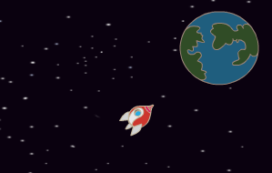

## L'animation à l'aide de boucles

Une autre façon d'animer le vaisseau spatial est de lui dire d'avancer un petit peu beaucoup de fois

--- task --- Supprime le bloc `glisser`{:class="block3motion"} de ton code. Pour ce faire, faites glisser le bloc de la zone de code et dépose-le là où se trouvent les autres blocs de code.


```blocks3
quand le drapeau vert pressé
s'orienter en direction de (0)
aller à x: (-150) y: (-150)
dire [c'est parti !] pendant (2) secondes
s'orienter vers (Terre v)

glisser en (1) secondes à x: (0) y: (0)
```

--- /task ---

--- task --- Maintenant, utilise un bloc `répéter`{:class="block3control"} pour déplacer ton vaisseau spatial vers la Terre?


```blocks3
lorsque le drapeau est cliqué
s'orienter en direction de (0)
aller à x: (-150) y: (-150)
dire [c'est parti !] pendant (2) secondes
s'orienter vers (Terre v)

+ répéter (200)
    déplacer de (2) pas
```

Teste et enregistre ton code. Ton vaisseau spatial devrait se déplacer exactement comme avant vers la Terre, mais cette fois-ci il utilise un bloc `répéter`{:class="block3control"}.

--- /task ---

--- task --- Ensuite, ajoute du code à ton sprite vaisseau spatial afin que le vaisseau spatial change de couleur lorsqu'il se déplace vers la Terre?

Utilise ce bloc:


```blocks3
lorsque le drapeau est cliqué
s'orienter en direction de (0)
aller à x: (-150) y: (-150)
dire [c'est parti !] pendant (2) secondes
s'orienter vers (Terre v)
répéter (200)
    avancer de (2) pas

+ ajouter (25) à l'effet [couleur v]
```

Teste et enregistre ton code.


--- /task ---

--- task --- Peux-tu faire en sorte que la taille de ton vaisseau spatial diminue au fur et à mesure qu'il arrive sur Terre?

--- hints ---


--- hint ---

Ton vaisseau spatial devrait commencer à `100% de taille`{:class="blocklooks"}, puis `changer la taille`{:class="blocklooks"} d'une petite quantité chaque fois qu'il se déplace.

--- /hint ---

--- hint ---

Tu devras ajouter ces blocs à ton code:


```blocks3
ajouter (10) à la taille

mettre la taille à (100) % de la taille initiale
```

--- /hint ---

--- hint ---

Ton code devrait ressembler à ceci:


```blocks3
lorsque le drapeau est cliqué
mettre la taille à (100)% de la taille initiale
s'orienter en direction de (0)
allez à x: (-150) y: (-150)
dire [c'est parti !] pendant (2) secondes
s'orienter vers (Terre v )
répéter (200) fois
avancer de (2) pas
ajouter (25) à l'effet [couleur v]

+ changer la taille de (-3)
```

--- /hint ---

--- /hints ---

--- /task ---

Teste et enregistre ton code. Ton vaisseau devrait maintenant être plus petit au fur et à mesure qu'il bouge. Teste ton vaisseau spatial une **seconde fois**. Est-ce la bonne taille quand il démarre ?

