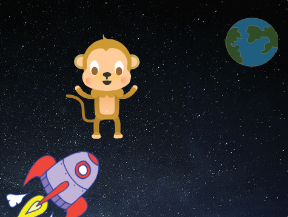
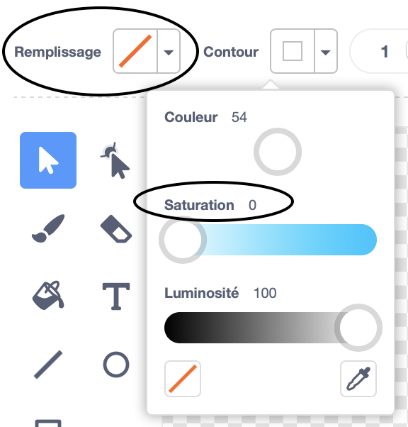

## Singe flottant

Maintenant tu vas ajouter un singe perdu dans l'espace à ton animation!

--- task --- Commence en ajoutant le lutin 'singe' de la bibliothèque.



--- /task ---

Clique sur ton nouveau sprite singe, puis sur **Costumes** pour pouvoir changer l'apparence du singe.

--- task --- Définis la transparence en sélectionnant la ligne rouge. Pour le contour, définis une couleur blanche en déplaçant le curseur de saturation à `0`.

 --- /task ---

--- task --- Clique sur l'outil **cercle** , puis utilise-le pour dessiner un casque blanc autour de la tête du singe.


--- /task ---

--- task --- Peux-tu ajouter du code à ton singe afin qu'il tourne lentement indéfiniment?

--- hints ---
 --- hint ---

Lorsque le drapeau vert **est cliqué** , ton sprite singe devrait **tourner** dans un cercle **indéfiniment** .

--- /hint --- --- hint ---

Voici les blocs dont tu as besoin:

```blocks3
répéter indéfiniment
end

tourner droite de (15) degrés

quand le drapeau vert pressé
```

--- /hint --- --- hint ---

Voici le code pour faire tourner ton singe:


```blocks3
quand le drapeau vert pressé
répéter indéfiniment 
    tourner droite de (1) degrés
end
```

--- /hint --- --- /hints ---

--- /task ---

Teste et enregistre ton projet. Tu devras cliquer sur le bouton rouge **arrêt** pour terminer cette animation, car elle tourne pour toujours!

