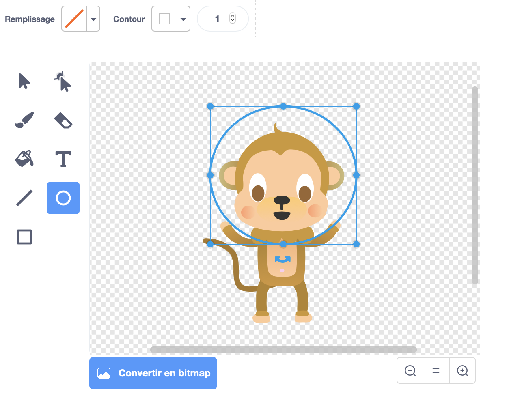

## Plus de boucles

+ Ajoutons maintenant un singe, perdu dans l'espace, à l'animation ! Commencez par choisir un lutin singe dans la bibliothèque.

	

+ Si vous cliquez sur votre nouveau lutin singe, puis sur l'onglet 'Costumes', vous pouvez modifier l'apparence de votre singe. Cliquez sur l'outil cercle (nommé ici 'Ellipse') et dessinez un casque blanc autour de la tête du singe.

	

+ Maintenant, cliquez sur l'onglet 'Scripts' et ajoutez du code pour que le singe tourne lentement et indéfiniment en rond :

	```blocks
		quand le drapeau vert pressé
		répéter indéfiniment
		   tourner droite de (1) degrés
	```

	

	Le bloc `répéter indéfiniment`{:class="blockcontrol"} est une boucle qui se répète sans fin. Vous devrez l'arrêter en cliquant sur le bouton 'stop' rouge à côté du drapeau vert.

+ Vous pouvez également combiner des boucles. Ajoutez un lutin 'étoile' à votre animation, et programmez-le comme ceci :

	```blocks
		quand le drapeau vert pressé
		répéter indéfiniment
			répéter (20) fois
				ajouter (2) à la taille
			end
			répéter (20) fois
				ajouter (-2) à la taille
			end
	```

	

+ Cliquez sur le drapeau pour tester l'animation de votre étoile. Que fait ce code ? Il fait légèrement grossir l'étoile 20 fois, puis rétrécir 20 fois pour revenir à sa taille du début. Et pour que cette animation recommence tout le temps, nous mettons ces deux boucles dans une troisième boucle `répéter indéfiniment`{:class="blockcontrol"}.
