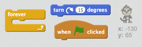
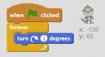

## Singe flottant

Ajoutons un singe perdu dans l'espace à votre animation!

+ Commencez par ajouter le lutin "singe" de la bibliothèque.
    
    

+ Si vous cliquez sur votre nouveau lutin, puis cliquez sur ** Costumes ** , vous pouvez éditer le look du singe. Cliquez sur l'outil ** ellipse ** et dessiner un scaphandre blanc autour de la tête du singe.
    
    

+ Pouvez-vous ajouter du code à votre singe afin qu'il tourne lentement indéfiniment?
    
    Testez et enregistrez votre projet. Vous devrez cliquer sur le bouton **d’arrêt** rouge pour terminer cette animation, sinon elle continuera pour toujours!
    
    

\--- hints \--- \--- hint \--- Lorsque le drapeau vert ** est cliqué ** , votre sprite singe devrait ** tourner ** dans un cercle ** indéfiniment ** . \--- /hint \--- \--- hint \--- Voici les blocs de code dont tu auras besoin:  \--- /hint \--- \--- hint \--- Voici le code pour faire tourner ton singe :  \--- /hint \--- \--- /hints \---