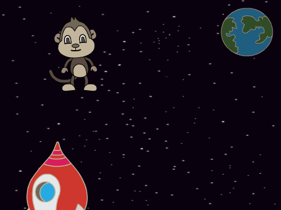

## Plus de boucles

Maintenant, vous allez ajouter un singe perdu dans votre espace!

\--- task \--- Commencez par ajouter le sprite 'monkey' de la bibliothèque.



\--- /task \---

Cliquez sur votre nouveau sprite singe, puis sur **Costumes** pour pouvoir modifier l'apparence du singe.

\--- tâche \--- Définissez le remplissage comme transparent en sélectionnant la ligne rouge. Pour le contour, définissez une couleur blanche en déplaçant le curseur Saturation sur `0`.

 \--- /task \---

\--- tâche \--- Cliquez sur l'outil **cercle** , puis utilisez-le pour dessiner un casque blanc autour de la tête du singe.


\--- /task \---

\--- task \--- Pouvez-vous ajouter du code à votre sprite singe afin qu'il tourne lentement dans un cercle pour toujours?

\--- hints \--- \--- hint \---

Lorsque le vert **drapeau est cliquée**, l' image - objet singe doit **tour** dans un cercle **pour toujours**.

\--- / indice \--- \--- indice \---

Voici les blocs de code dont vous avez besoin:

```blocks3
toujours
fin

tour cw (15) degrés

lorsque le drapeau est cliqué
```

\--- / indice \--- \--- indice \---

Voici le code pour faire tourner votre singe:


```blocks3
lorsque le drapeau est cliqué
pour toujours
    tour cw (1) degrés
```

\--- /hint \--- \--- /hints \---

\--- /task \---

Testez et enregistrez votre projet. Vous devrez cliquer sur le bouton rouge **stop** pour terminer cette animation, car elle tourne pour toujours!

