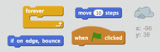
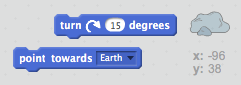
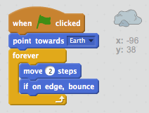

## Astéroïde rebondissant

Ajoutons quelques météores flottant à votre animation.

+ Ajoutez un lutin «rock» à votre animation.
    
    

+ Pouvez-vous coder votre lutin pour rebondir autour de la scène?
    
    

\--- hints \--- \--- hint \--- When the green **flag is clicked**, your rock sprite should **move** and **bounce** around the stage **forever**. \--- /hint \--- \--- hint \--- Here are the code blocks you'll need:  You can also set a more interesting starting direction for the rock with one of these blocks:  \--- /hint \--- \--- hint \--- Here's the code to bounce your rock around the stage:  \--- /hint \--- \--- /hints \---