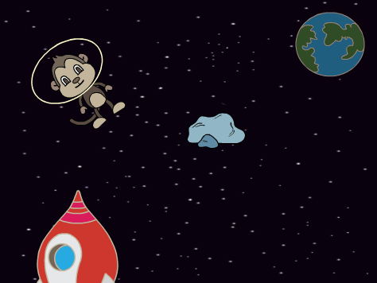
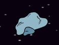

## Astéroïde rebondissant

Maintenant tu vas ajouter une météore flottante à ton animation.

--- task --- Ajoute un sprite 'météore' à ton animation.



--- /task ---

--- task --- Peux-tu ajouter du code pour ton sprite météore afin qu'elle rebondisse sur la scène?



--- hints ---
 --- hint --- quand le **drapeau vert pressé**, ton sprite météore doit **déplacer** et **rebondir** autour de la scène **indéfiniment**.
--- /hint ---
 --- hint --- Voici les blocs de code dont tu auras besoin:

```blocks3
move (10) steps

if on edge bounce

when flag clicked

forever
```

Tu peux également définir une direction de départ plus intéressante pour le sprite météore avec l'un de ces blocs:

```blocks3
turn cw (15) degrees

point towards (Terre v)
```

--- /hint --- --- hint ---

Voici le code pour faire rebondir ta météore sur la scène:


```blocks3
when flag clicked
point towards (Terre v)
forever
    move (2) steps
    if on edge, bounce
```

--- /hint --- --- /hints --- --- /task ---