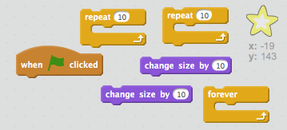
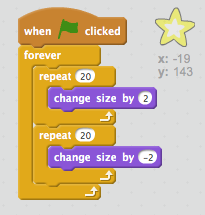

## Étoile brillante

Créeons des boucles pour faire une étoile brillante.

+ Ajoutez un lutin «star» à votre animation.
    
    

+ Pouvez-vous coder votre étoile pour qu'elle grossisse et rétrécisse tout le temps?
    
    

\--- hints \--- \--- hint \--- Lorsque le drapeau vert ** est cliqué ** , votre lutin étoile devrait ** changer de taille ** pour grossir plusieurs fois, puis ** changer de taille ** devenir plus petit plusieurs fois. Il devrait le faire pour qu'il grandisse puis rétrécisse ** pour toujours ** . \--- /hint \--- \--- hint \--- Voici les blocs de code dont tu auras besoin:  \--- /hint \--- \--- hint \--- Voici le code pour faire briller ton étoile :  \--- /hint \--- \--- /hints \---