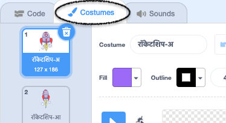
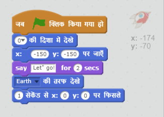

## चरण 1: स्पेसशिप एनिमेट करना

चलिए पृथ्वी की ओर उड़ने वाला स्पेसशिप बनाएँ!

+ नया खाली Scratch प्रोजेक्ट खोलें।

[[[generic-scratch-new-project]]]

+ अपनी स्टेज में 'अनतरिक्ष यान' और 'पृथ्वी' स्प्राइट जोड़ें।

    

[[[generic-scratch-sprite-from-library]]]

+ अपनी स्टेज में 'सितारे' बैकड्रॉप जोड़ें।

    

[[[generic-scratch-backdrop-from-library]]]

+ अपने स्पेसशिप स्प्राइट पर क्लिक करें, और **पोशाक** टैब पर क्लिक करें।

	

+ चित्र चुनने के लिए **तीर** टूल का उपयोग करें। फिर चक्राकार **घुमाएँ** हैंडल पर क्लिक करें, और छवि को तब तक घुमाएँ जब तक यह इसकी बगल में न आ जाए।

    

+ अपने स्पेसशिप स्प्राइट में यह कोड जोड़ें:

    

    कोड ब्लॉक्स में संख्याओं को बदलें ताकि कोड सटीक रूप से उपर्युक्त छवि जैसा दिखाई दे।

    यदि आप हरे फ्लैग पर क्लिक करते हैं, तो आप देखेंगे कि स्पेसशिप बोलता है, मुड़ता है, और स्टेज के केंद्र की ओर बढ़ता है।

    

[[[generic-scratch-saving]]]

--- challenge ---
## चुनौती: अपनी एनिमेशन में सुधार करना
क्या आप अपने एनिमेशन कोड में संख्याओं को बदल सकते हैं, ताकि:

+ स्पेसशिप तब तक गति करता रहे जब तक यह पृथ्वी को छू न ले?
+ स्पेसशिप पृथ्वी की ओर अधिक धीमी गति से बढ़े?

आपको इस ब्लॉक में संख्याओं को बदलना होगा:

[[[generic-scratch-coordinates]]]

--- /challenge ---
