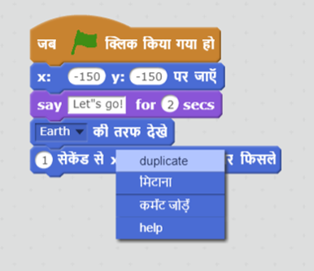
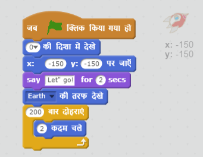
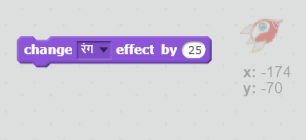
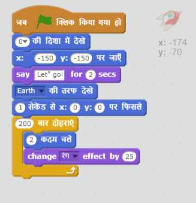
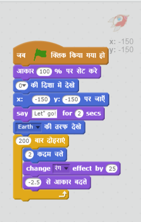

## चरण 2: लूप्स का इस्तेमाल करके एनिमेट करना

स्पेसशिप को एनिमेट करने का अन्य तरीका है कि इसे कई बार छोटी मात्रा में स्थानांतरित किया जाए।

+ अपने कोड में से `पर फिसलें` ब्लॉक पर दायाँ क्लिक करके और **delete** (हटाएँ) पर क्लिक करके इसे हटाएं। आप कोड को स्क्रिप्ट क्षेत्र से बाहर की ओर ड्रैग करके भी हटा सकते हैं और कोड ब्लॉक्स क्षेत्र में वापस ला सकते हैं।

	

+ क्या आप अपनी स्पेसशिप को पृथ्वी की और स्थानांतरित करके `बार दोहराएँ` ब्लॉक का उपयोग कर सकते हैं?

    परीक्षण करें और सहेजें: इस बार `बार दोहराएँ` ब्लॉक का उपयोग करके आपकी स्पेसशिप को पहले की तरह ही पृथ्वी की ओर स्थानांतरित होना चाहिए।

    

--- hints ---
--- hint ---
__पर फिसलें__ की बजाय, आपकी स्पेसशिप को __बार-बार__ एक समय पर कुछ कदम __स्थानांतरित__ होना चाहिए।
--- /hint ---
--- hint ---
ये वे कोड ब्लॉक हैं, जिनकी आपको आवश्यकता होगी:

--- /hint ---
--- hint ---
आपकी स्पेसशिप को एनिमेट करने के लिए कोड इस प्रकार है:

(जब तक स्पेसशिप पृथ्वी तक आ जाती है, तब तक आप `बार दोहराएँ` और `चलें` ब्लॉक में भिन्न संख्याओं का इस्तेमाल कर सकते हैं!)
--- /hint ---
--- /hints ---

+ क्या आप स्पेसशिप को इसके पृथ्वी की ओर बढ़ने के साथ, रंग बदलने के लिए कोड कर सकते हैं?

    परीक्षण करें और सहेजें।

    

--- hints ---
--- hint ---
स्थानांतरित होने के साथ आपकी स्पेसशिप __का रंग__ बदल जाना चाहिए।
--- /hint ---
--- hint ---
आपके लिए आवश्यक अतिरिक्त कोड ब्लॉक्स इस प्रकार हैं:

--- /hint ---
--- hint ---
आपकी स्पेसशिप के रंग में परिवर्तन के लिए कोड इस प्रकार है:

--- /hint ---
--- /hints ---

+ क्या आप ऐसा कर सकते हैं कि पृथ्वी की ओर बढ़ने के साथ स्पेसशिप छोटी दिखाई दे?

    परीक्षण करें और सहेजें। आपकी स्पेसशिप स्थानांतरित होने पर छोटी दिखाई देनी चाहिए। __दूसरी बार__ अपनी स्पेसशिप का परीक्षण करें।  क्या आरंभ में इसका आकार उचित है?

    

--- hints ---
--- hint ---
आपकी स्पेसशिप को __100% आकार__ एक साथ शुरू करना चाहिए, और फिर स्थानांतरित होने पर छोटी मात्रा में __आकार बदलना__ चाहिए।
--- /hint ---
--- hint ---
आपके लिए आवश्यक कोड ब्लॉक्स इस प्रकार हैं:

--- /hint ---
--- hint ---
स्थानांतरित होने पर आपकी स्पेसशिप के आकार में परिवर्तन के लिए कोड इस प्रकार है:

--- /hint ---
--- /hints ---
