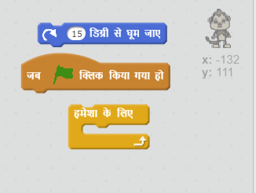
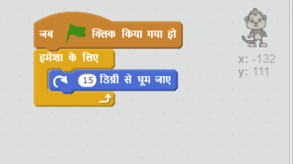

## चरण 3: तैरने वाला बंदर

चलिए आपकी एनिमेशन में बंदर बनाएँ, जो अन्तरिक्ष में खो गया है!

+ लाइब्रेरी से 'बंदर' स्प्राइट जोड़कर शुरू करें।

	

+ यदि आप अपने नए बंदर के स्प्राइट पर क्लिक करते हैं और **पोशाक** पर क्लिक करते हैं, तो आप बंदर के रूप में परिवर्तन कर सकते हैं। **दीर्घवृत्त** टूल पर क्लिक करें और बंदर के सिर के चारों ओर अन्तरिक्ष वाला सफेद हेल्मेट बनाएँ।

	

+ क्या आप अपने बंदर के स्प्राइट में कोड जोड़ सकते हैं ताकि यह हमेशा चक्र में घूमता रहे?

    अपने प्रोजेक्ट का परीक्षण करें और सहेजें। इस एनिमेशन को समाप्त करने के लीर आपको **रोक दें** बटन पर क्लिक करना होगा, क्योंकि यह हमेशा चलता रहता है!

    

--- hints ---
--- hint ---
जब हरे __फ्लैग पर क्लिक किया जाता है__, तो आपके बंदर के स्प्राइट को __हमेशा के लिए__ चक्र में __घूमते__ रहना होगा।
--- /hint ---
--- hint ---
ये वे कोड ब्लॉक हैं, जिनकी आपको आवश्यकता होगी:

--- /hint ---
--- hint ---
आपके बंदर को स्पिन करने के लिए कोड इस प्रकार है:

--- /hint ---
--- /hints ---
