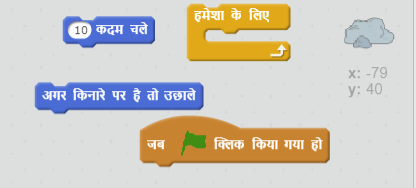
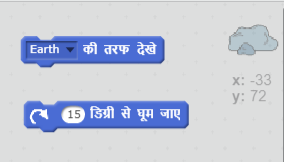
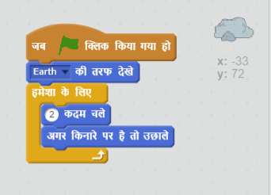

## चरण 4: उछलने वाले क्षुद्रग्रह

चलिए आपकी एनिमेशन में कुछ अन्तरिक्ष में उड़ने वाली चट्टान बनाएँ।

+ अपनी एनिमेशन में 'चट्टान' स्प्राइट जोड़ें।

	

+ क्या आप अपने रॉक स्प्राइट को स्टेज में उछलने के लिए कोड कर सकते हैं?

    

--- hints ---
--- hint ---
जब हरे __फ्लैग पर क्लिक किया जाता है__, तो आपके रॉक स्प्राइट को __हमेशा के लिए__ स्टेज में __चलना__ और __उछलना होगा__ ।
--- /hint ---
--- hint ---
ये वे कोड ब्लॉक हैं, जिनकी आपको आवश्यकता होगी:

आप इनमें से एक ब्लॉक के साथ चट्टान के लिए और भी दिलचस्प आरंभिक दिशा निर्धारित कर सकते हैं:

--- /hint ---
--- hint ---
आपकी चट्टान को स्टेज में उछालने के लिए कोड इस प्रकार है:

--- /hint ---
--- /hints ---
