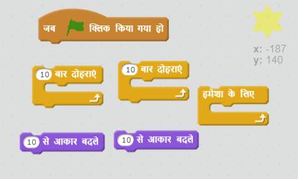
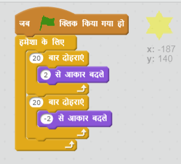

## चरण 5: शाइनिंग स्टार

चलिए चमकता सितारा बनाने के लिए लूप्स को संयुक्त करें।

+ अपनी एनिमेशन में 'star' स्प्राइट जोड़ें।

	

+ क्या आप अपने सितारे को ऐसा कोड कर सकते हैं कि इसका आकार बड़ा-छोटा होता रहे?

    

--- hints ---
--- hint ---
जब हरे __फ्लैग पर क्लिक किया जाता है__, तो __कुछ गुणा बड़ा होने के लिए__ आपके स्टार स्प्राइट का __आकार बदल जाना चाहिए,__ और फिर कुछ गुणा छोटा होने के लिए आकार बदल जाना चाहिए। इसे ऐसा इसलिए करना चाहिए ताकि इसका आकार __हमेशा के लिए__ छोटा-बड़ा होता रहे।
--- /hint ---
--- hint ---
ये वे कोड ब्लॉक हैं, जिनकी आपको आवश्यकता होगी:

--- /hint ---
--- hint ---
आपके सितारे को चमकता दिखाने के लिए कोड इस प्रकार है:

--- /hint ---
--- /hints ---
