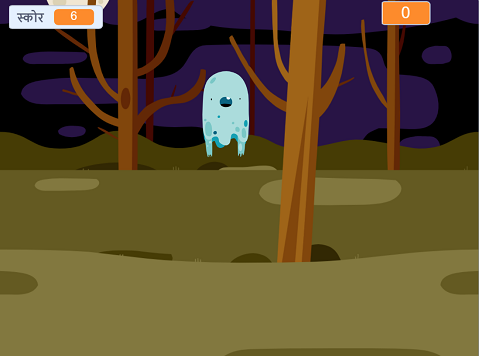

## आगे क्या?

[घोस्टबस्टर्स](https://projects.raspberrypi.org/hi-IN/projects/ghostbusters?utm_source=pathway&utm_medium=whatnext&utm_campaign=projects) परियोजना पर प्रयास करें! उस प्रोजेक्ट में, आप भूत वाला एक गेम बनाना सीखेंगे जिसमे भूत चारो ओर दिखाए देंगे और आपको उन्हें पकड़ना हैं। एक टाइमर ओर एक स्कोर आपके गेम में कैसे जोड़ना हैं वो भी सिखिंगे, ताकि आप देख सकें की आप कितने भूतो को पकड़ पाए।

--- no-print ---

  <iframe allowtransparency="true" width="485" height="402" src="https://scratch.mit.edu/projects/embed/276874679/?autostart=false" frameborder="0" scrolling="no"></iframe>
  

--- /no-print ---

--- print-only ---

--- /print-only ---

***
समुदाय के योगदान से किया गया अनुवाद

इस परियोजना का अनुवाद सोनल सान्निग्रही] ने किया है और समीक्षा Saurav द्वारा कि गयी  है।

हमारे अद्भुत अनुवाद स्वयंसेवक हमारी मदद करते है ताकि हम दुनिया भर के बच्चों को कोड करना सीखने का मौका प्रदान कर सके।. आप हमारी परियोजनाओं का अनुवाद करके और अधिक बच्चों तक पहुंचने में हमारी सहायता कर सकते हैं - [rpf.io/translate](https://rpf.io/translate) पर जाकर अधिक जानकारी हासिल करे