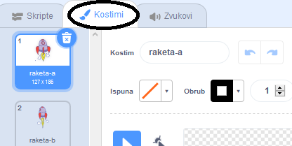
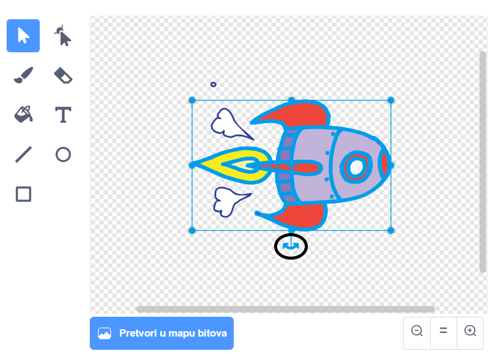

## Animacija svemirskog broda

Tvoj prvi korak biti će stvaranje svemirskog broda koji leti prema Zemlji!

\--- task \---

Otvori novi Scratch projekt.

**Online:** open a new online Scratch project at [rpf.io/scratch-new](https://rpf.io/scratchon){:target="_blank"}.

**Offline:** otvori novi projekt u offline uređivaču.

If you need to download and install the Scratch offline editor, you can find it at [rpf.io/scratchoff](https://rpf.io/scratchoff){:target="_blank"}.

\--- /task \---

\--- task \---

Dodaj likove „ rocketship” (raketa) i „ Earth” (Zemlja) na svoju Pozornicu.


[[[generic-scratch3-sprite-from-library]]]

\--- /task \---

\--- task \---

Dodaj pozadinu „ Stars” (Zvijezde) na Pozornicu.


\--- /task \---

\--- task \---

Klikni na lika svemirskog broda, a zatim na karticu **Kostimi**.



\--- /task \---

\--- task \---

Upotrijebi alat u obliku **strelice** i klikni na svemirski brod, a zatim napravi okvir oko slike cijelog svemirskog broda. Zatim klikni na okrugli alat za **rotiranje** u obliku dvostruke strelice i okreni sliku bočno.



\--- /task \---

\--- task \---

Dodaj ovaj kôd liku svemirskog broda:


```blocks3
kada je zelena zastava kliknut
okreni se u smjeru (0)
idi na x: (-150) y: (-150)
govori [Kreni] (2) sekundi
okreni se prema (Earth v)
klizi (1) sekundi do x: (0) y: (0)
```

Promijeni brojeve u blokovima kôda tako da kôd bude potpuno isti kao kôd iznad.

\--- /task \---

Kada klikneš na zelenu zastavicu, svemirski brod trebao bi govoriti, okretatu se i klizati prema sredini pozornice.

