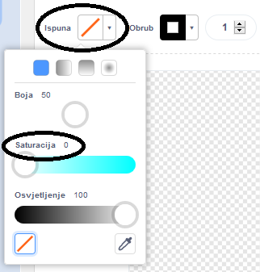
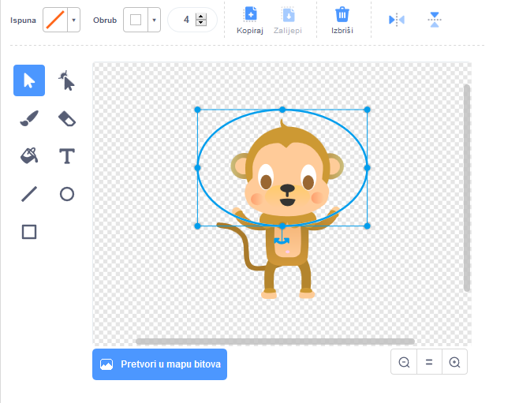

## Plutajući majmun

Sada ćete svojoj animaciji dodati majmuna koji se izgubio u svemiru!

\--- task \--- Započnite dodavanjem lika 'majmun' iz biblioteke.


\--- /task \---

Kliknite svoj novi link majmuna, a zatim kliknite **Costumes** tako da možete urediti izgled majmuna.

\--- task \--- Postavite ispunu tako da bude transparentna odabirom crvene linije. Za konturu postavite bijelu boju pomicanjem klizača Zasićenje na `0`.

 \--- /task \---

\--- task \--- Kliknite na **circle** a zatim pomoću njega nacrtajte bijelu svemirsku kacigu oko majmunove glave.



\--- /task \---

\--- task \--- Možete li dodati kod svom liku majmuna tako da se polako zavrti zauvijek u krugovima?

\--- hints \--- \--- hint \---

Kada je zelena **flag is clicked**, tvoj lik majmuna trebao bi se **turn** u krug **forever**.

\--- /hint \--- \--- hint \---

Evo blokova koda koji su vam potrebni:

```blocks3
forever
end

turn cw (15) degrees

when flag clicked
```

\--- /hint \--- \--- hint \---

Evo koda za kreiranje vrtnje vašeg majmuna:


```blocks3
when flag clicked
forever
    turn cw (1) degrees
```

\--- /hint \--- \--- /hints \---

\--- /task \---

Testirajte i spremite svoj projekt. Morat ćete kliknuti na crveni **stop** gumb za završetak ove animacije, jer traje zauvijek!

