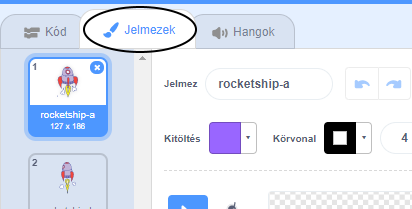
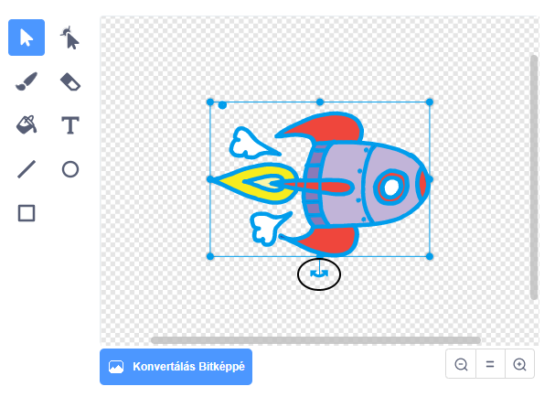

## Űrhajó animálása

Első lépésként hozz létre egy űrhajót, ami a Föld felé repül!

\--- task \---

Nyiss meg egy új Scratch projektet.

**Online:** nyiss megy egy új online Scratch projektet itt:[rpf.io/scratch-new](http://rpf.io/scratchon){:target="_ blank"}.

**Offline:** nyiss egy új projektet az offline szerkesztőben.

Ha le szeretnéd tölteni és telepíteni a Scratch offline szerkesztőt, akkor azt itt találod: [rpf.io/scratchoff](http://rpf.io/scratchoff){:target="_blank"}.

\--- /task \---

\--- task \---

Add 'rocketship' and 'Earth' sprites to your Stage.


[[[generic-scratch3-sprite-from-library]]]

\--- /task \---

\--- task \---

Add the 'Stars' backdrop to your Stage.


\--- /task \---

\--- task \---

Click on your spaceship sprite, and click on the **Costumes** tab.



\--- /task \---

\--- task \---

Use the **arrow** tool to click and drag a box around the whole spaceship image. Then click on the circular **rotate** handle, and rotate the image until it is on its side.



\--- /task \---

\--- task \---

Add this code to your spaceship sprite:


```blocks3
⚑-ra kattintáskor
nézz (0) fokos irányba
ugorj ide: x: (-150) y: (-150)
mondd: [Indulás] (2) másodpercig
nézz (Earth) felé
csússz (1) mp-ig ide x: (0) y: (0)
```

Change the numbers in the code blocks you've added so that the code is exactly the same as above.

\--- /task \---

If you click the green flag, you should see the spaceship speak, turn, and glide towards the centre of the stage.

