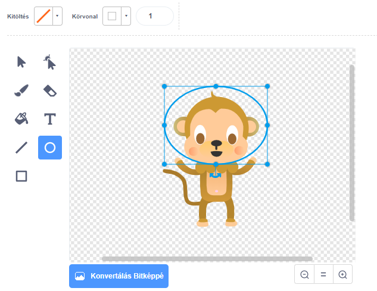

## Lebegő majom

Most hozzá fogsz adni az animációdhoz egy majomot, aki elveszett az űrben!

\--- task \--- Először is add hozzá a 'monkey' szereplőt a könyvtárból.


\--- /task \---

Kattints az új majom szereplőre, majd a **Jelmezekre**, hogy megváltoztasd a majom kinézetét.

\--- task \--- Állítsd a kitöltést átlátszóvá a piros vonal kiválasztásával. A körvonalhoz állíts be egy fehér színt és a Telítettség csúszkát húzd le `0`-ra.

 \--- /task \---

\--- task \--- Kattints a **kör** eszközre, majd rajzolj egy fehér űrsisakot a majom feje köré.



\--- /task \---

\--- task \--- Hozzá tudod adni a kódhoz a majom szereplőt, hogy lassan, folyamatosan körbe forduljon?

\--- hints \--- \--- hint \---

Amikor a zöld **zászlóra kattintasz**, a majom szereplőnek **forognia** kell egy körben **örökre**.

\--- /hint \--- \--- hint \---

Íme a szükséges kódblokkok:

```blocks3
mindig
end

fordulj ↻ (15) fokot

⚑ -ra kattintáskor
```

\--- /hint \--- \--- hint \---

Itt van a kód, ami megforgatja a majmod:


```blocks3
⚑ -ra kattintáskor
mindig 
  fordulj ↻ (1) fokot
end
```

\--- /hint \--- \--- /hints \---

\--- /task \---

Teszteld és mentsd le a projektet. Az animáció befejezéséhez kattints a piros **stop** gombra, különben végtelenszer lefutna!

