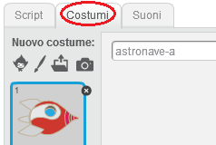
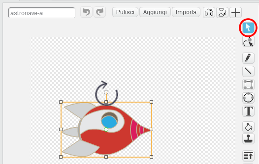
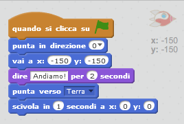

## Animare un'astronave

Creiamo un'astronave che vola verso la Terra!

+ Inizia un nuovo progetto Scratch, e cancella lo sprite del gatto così che il tuo progetto sia vuoto. Puoi trovare l'editore Scratch online a <a href="http://jumpto.cc/scratch-new" target="_blank">jumpto.cc/scratch-new</a>.

+ Aggiungi al tuo quadro gli sprite 'Astronave' e 'Terra. Puoi anche aggiungere al tuo quadro lo scenario 'Stelle'. Il tuo quadro dovrebbe essere così:

	

+ Clicca sul tuo nuovo sprite di astronave, e clicca il tab 'Costumi'.

	

+ Usa la freccia per selezionare l'immagine. Clicca poi sulla maniglia circolare e ruota l'immagine finché si trova sul suo lato.

	

+ Aggiungi questo codice allo sprite dell'astronave:

	

	Cambia i numeri nei blocchi di codice, in modo che il codice sia esattamente lo stesso dell'immagine sopra.

+ Se clicchi sui blocchi per far funzionare il codice, dovresti vedere l'astronave parlare, girare e muoversi verso il centro del quadro.

	

	La posizione dello schermo `x:(0) y:(0)`{:class="blockmotion"} è il centro del quadro. Una posizione come `x:(-150) y:(-150)`{:class="blockmotion"} è verso la parte bassa a sinistra del quadro, e una posizione come `x:(150) y:(150)`{:class="blockmotion"} è vicino alla parte alta a destra.

	

	Se hai bisogno di sapere le coordinate di una posizione sul quadro, muovi il mouse nella posizione che vuoi e annota le coordinate, che sono visualizzate sotto il quadro.

	

+ Prova la tua animazione, cliccando sulla bandiera verde appena sopra il quadro.

	

--- challenge ---
## Sfida: Migliora la tua animazione
Puoi cambiare i numeri nel codice della tua animazione in modo che:
+ L'astronave si muova finché tocca la Terra?
+ L'astronave si muova più lentamente verso la Terra?

Dovrai cambiare i numeri in questo blocco:

```blocks
	scivola in (1) secondi a x: (0) y: (0)
```

--- /challenge ---
