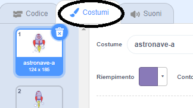

## Animare un'astronave

Il tuo primo passo sarà quello di creare una astronave che si dirige verso la Terra!

\--- task \---

Inizia un nuovo progetto Scratch.

**Online:** open a new online Scratch project at [rpf.io/scratch-new](https://rpf.io/scratchon){:target="_blank"}.

**Offline:** apri un nuovo progetto nell'editor offline.

If you need to download and install the Scratch offline editor, you can find it at [rpf.io/scratchoff](https://rpf.io/scratchoff){:target="_blank"}.

\--- /task \---

\--- task \---

Aggiungi gli sprite 'Astronave' e 'Terra' al tuo stage.


[[[generic-scratch3-sprite-from-library]]]

\--- /task \---

\--- task \---

Aggiungi lo sfondo 'Stelle' al tuo stage.


\--- /task \---

\--- task \---

Fai clic sullo sprite 'Astronave' e poi clicca sulla scheda **Costumi**.



\--- /task \---

\--- task \---

Usa lo strumento **freccia** per cliccare e trascinare una casella intorno all'intera immagine dell'astronave. Quindi clicca sulla maniglia circolare **ruota** e ruota l'immagine fino a quando non appoggia sul lato.


\--- /task \---

\--- task \---

Aggiungi questo codice allo sprite della tua astronave:


```blocks3
when flag clicked
point in direction (0)
go to x:(-150) y:(-150)
say [Let's go] for (2) seconds
point towards (Earth v)
glide (1) secs to x:(0) y:(0)
```

Cambia i numeri nei blocchi di codice, che hai aggiunto, in modo che sia esattamente lo stesso di cui sopra.

\--- /task \---

Facendo click sulla bandierina verde, dovresti vedere l'astronave parlare, girare e planare verso il centro dello stage.

