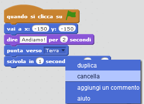

## Animare usando i loop

Un'altra maniera per animare l'astronave è di dirle di muoversi in piccole quantità, un sacco di volte.

+ Cancella il blocco `scivola`{:class="blockmotion"} dal tuo codice, facendo clic col pulsante destro sul blocco e cliccando 'cancella'. Puoi anche cancellare il codice trascinandolo fuori dall'area del testo fino all'area dei blocchi di codici.

	

+ Una volta che hai rimosso il codice, aggiungi questo altro codice:

	

	Il blocco `ripeti`{:class="blockcontrol"} è usato per ripetere tante volte qualcosa, ed è noto anche come_loop_.

+ Se clicchi la bandiera per provare questo nuovo codice, vedrai che fa più o meno la stessa cosa di prima.

+ Puoi aggiungere un altro codice al tuo loop per fare cose interessanti. Aggiungi nel loop il blocco `cambia effetto colore di 25`{:class="blocklooks"} (dalla sezione 'Apparenze'), per cambiare ripetutamente il colore dell'astronave mentre si muove:

	

+ Clicca la bandiera per vedere la tua nuova animazione.

	

+ Puoi anche fare in modo che l'astronave si rimpicciolisca man mano che si avvicina alla Terra.

	

+ Prova la tua animazione. Che succede se clicchi la bandiera una seconda volta? La tua astronave inizia alla misura giusta? Puoi usare questo blocco per aggiustare la tua animazione:

	```blocks
		porta dimensione al (100) %
	```
