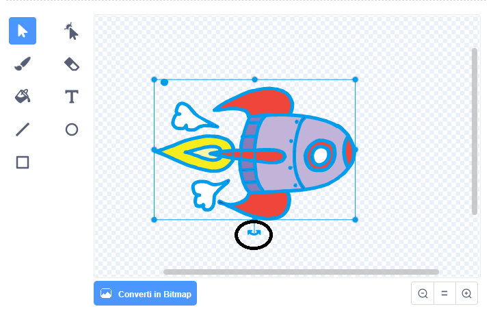

## Passaggio 1: animazione di un'astronave

Facciamo un'astronave che vola verso la Terra!

+ Apri un nuovo progetto di Scratch, vuoto.

[[[generic-scratch-new-project]]]

+ Aggiungi le sprites 'astronave' e 'Terra' al tuo Stage.
    
    

[[[generic-scratch-sprite-from-library]]]

+ Aggiungi lo sfondo "Stelle" al tuo Stage.
    
    

[[[generic-scratch-backdrop-from-library]]]

+ Fai clic sulla sprite dell'astronave e successivamente fai clic sulla scheda ** Costumi **.
    
    

+ Utilizzare lo strumento **freccia** per selezionare l'immagine. Quindi fare clic sulla maniglia circolare **ruotare** e ruotare l'immagine fino a quando non è coricata sul suo lato.
    
    

+ Aggiungi questo codice alla tua sprite dell'astronave:
    
    
    
    Cambia i numeri nei blocchi di codice in maniera che il codice sia identico a quello dell'immagine sopra.
    
    Se fai clic sulla bandiera verde dovresti vedere l'astronave parlare, girare e planare verso il centro della scena.
    
    

[[[generic-scratch-saving]]]

\--- challenge \---

## Challenge: improving your animation

Can you change the numbers in your animation code, so that:

+ The spaceship moves until it touches the Earth?
+ The spaceship moves more slowly towards the Earth?

You'll need to change the numbers in this block:

[[[generic-scratch-coordinates]]]

\--- /challenge \---