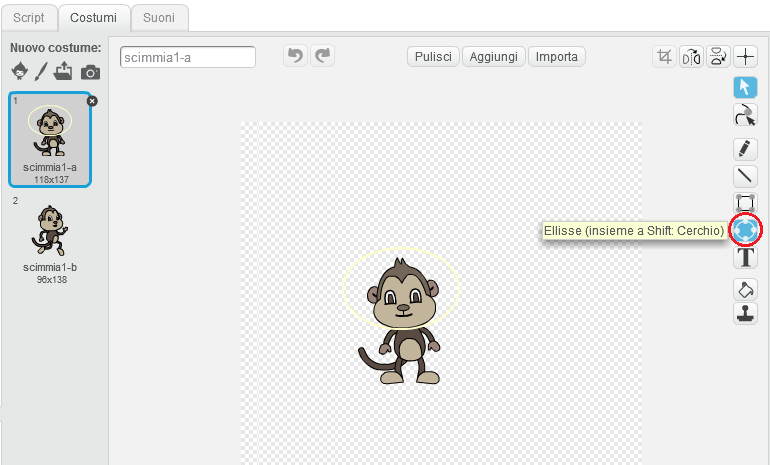

## Scimmie Fluttuanti

Aggiungiamo alla tua animazione delle scimmie che si sono perdute nello spazio!

+ Inizia aggiungendo dalla libreria lo sprite della scimmia.

	

+ Se clicchi sul tuo nuovo sprite della scimmia e poi clicchi 'Costumi', puoi modificare il costume della scimmia. Clicca sullo strumento 'Ellissi' e disegna attorno alla testa della scimmia un casco spaziale bianco.

	

+ Ora clicca 'Scritte' e aggiungi questo codice alla scimmia, così che ruoti lentamente in circolo per sempre:

	```blocks
		quando si clicca sulla bandiera verde
		per sempre
  			ruota in senso orario di (1) gradi
		end
	```

	Il blocco `per sempre`{:class="blockcontrol"} è un altro loop, ma uno che non finisce mai.

+ Clicca sulla bandiera per provare la scimmia. Dovrai cliccare il tasto stop (accanto alla bandiera) per termnare questa animazione.

	
