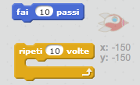
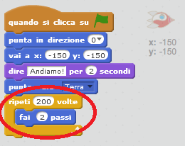
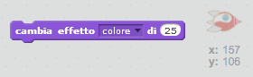
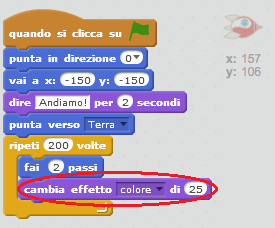
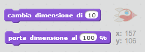
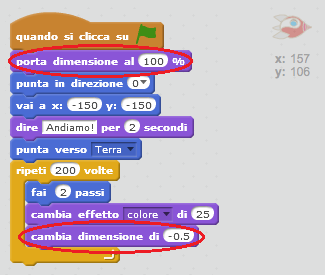

## Animating using loops

Un altro modo per animare l'astronave è di dirle di muoversi di un paio di passi tante volte.

+ Rimuovi il blocco `scivola`dal tuo codice cliccando con il tasto destro del mouse sul blocco e scegliendo **cancella**. Puoi anche eliminare il codice trascinandolo dall'area grigia verso l'area dei blocchi di codice.
    
    

+ Puoi usare il blocco `ripeti` per far muovere l'astronave verso la Terra?
    
    Prova il tuo codice e salvalo: la tua astronave dovrebbe muoversi verso la Terra come prima, ma questa utilizzando il blocco `ripeti`.
    
    

\--- hints \--- \--- hint \--- Invece di **scivolare**, la tua astronave dovrebbe **muoversi** **ripetutamente** di qualche passo alla volta. \--- /hint \--- \--- hint \--- Ecco di quali blocchi di codice avrai bisogno:  \--- /hint \--- \--- hint \--- Ecco il codice che animerà la tua astronave:  (Puoi utilizzare numeri diversi nei blocchi `ripeti` e `fai ... passi`, l'importante è che l'astronave raggiunga la Terra!) \--- /hint \--- \--- /hints \---

+ Puoi aggiungere del codice per far sì che la tua astronave cambi colore mentre si muove verso la Terra?
    
    Prova il tuo codice e salvalo.
    
    

\--- hints \--- \--- hint \--- La tua astronave dovrebbe **cambiare colore** mentre si muove. \--- /hint \--- \--- hint \--- Ecco il blocco di codice in più di cui avrai bisogno:  \--- /hint \--- \--- hint \--- Ecco il codice che farà cambiare colore alla tua astronave:  \--- /hint \--- \--- /hints \---

+ Puoi rendere la tua astronave più piccola man mano che si avvicina alla Terra?
    
    Prova il tuo progetto e salvalo. La tua astronave dovrebbe rimpicciolirsi man mano che si muove. Fai **un'altra prova**. È della dimensione giusta quando si trova nella posizione iniziale?
    
    

\--- hints \--- \--- hint \--- La tua astronave dovrebbe avere una **dimensione del 100%**, e poi dovrebbe **cambiare dimensione** man mano che si muove. \--- /hint \--- \--- hint \--- Ecco il blocco di codice in più di cui avrai bisogno:  \--- /hint \--- \--- hint \--- Ecco il codice che farà cambiare la dimensione della tua astronave mentre si muove:  \--- /hint \--- \--- /hints \---