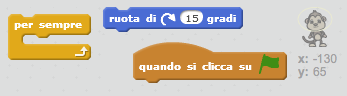
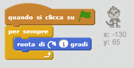

## Scimmietta fluttuante

Aggiungiamo alla tua animazione una scimmietta che si è persa nello spazio!

+ Inizia aggiungendo lo sprite 'scimmia' dalla libreria.
    
    

+ Facendo click sullo sprite 'scimmia' e poi sulla scheda **Costumi**, puoi modificare l'aspetto della scimmietta. Clicca sullo strumento **ellisse** per disegnare un casco sulla testa della scimmietta.
    
    

+ Puoi aggiungere del codice allo sprite della tua scimmietta per far sì che giri continuamente su stessa?
    
    Prova il tuo codice e salva il progetto. Per fermare l'animazione dovrai cliccare sul pulsante **rosso**, altrimenti andrà avanti all'infinito!
    
    

\--- hints \--- \--- hint \--- Dopo aver **cliccato su ⚑**, la tua scimmietta dovrebbe **ruotare** su se stessa **per sempre**. \--- /hint \--- \--- hint \--- Ecco di quali blocchi di codice avrai bisogno:  \--- /hint \--- \--- hint \--- Ecco il codice che farà ruotare la tua scimmietta:  \--- /hint \--- \--- /hints \---