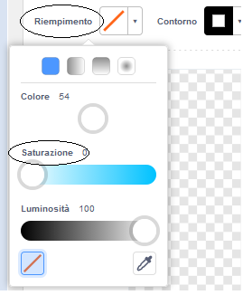
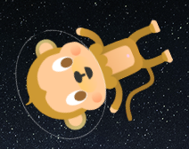

## Scimmietta fluttuante

Aggiungiamo alla tua animazione una scimmietta che si è persa nello spazio!

\--- task \--- Inizia aggiungendo lo sprite 'Monkey' dalla libreria.


\--- /task \---

Facendo click sullo sprite 'Monkey' e poi sulla scheda **Costumi**, puoi modificare l'aspetto della scimmietta.

\--- attività \--- Imposta il riempimento affinchè sia trasparente selezionando la linea diagonale rossa. Per il contorno, imposta un colore bianco spostando il cursore Saturazione a `0`.

 \--- /task \---

\--- task \--- Fare clic sullo strumento **cerchio ** e poi usalo per disegnare un casco spaziale bianco intorno alla testa della scimmia.


\--- /task \---

\--- task \--- Puoi aggiungere del codice alla tua scimmia in modo che ruoti lentamente per sempre?

\--- hints \--- \--- hint \---

Quando si clicca **la bandiera verde**, il tuo sprite scimmia dovrebbe **girare** in cerchio **per sempre**.

\--- /hint \--- \--- hint \---

Ecco i blocchi di codice che ti serviranno:

```blocks3
forever
end

turn cw (15) degrees

when flag clicked
```

\--- /hint \--- \--- hint \---

Ecco il codice per far girare la tua scimmia:


```blocks3
when flag clicked
forever
    turn cw (1) degrees
```

\--- /hint \--- \--- /hints \---

\--- /task \---

Prova e salva il tuo progetto. Dovrai cliccare sul pulsante rosso **stop** per terminare questa animazione, perché è in esecuzione per sempre!

