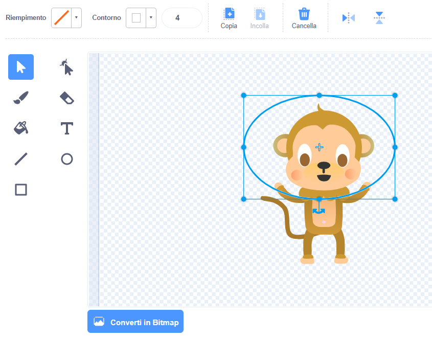

## Step 3: Floating monkey

Let's add a monkey who's lost in space to your animation!

+ Start by adding the 'monkey' sprite from the library.
    
    

+ If you click on your new monkey sprite and then click **Costumes**, you can edit how the monkey looks. Click the **ellipse** tool and draw a white space helmet around the monkey's head.
    
    

+ Puoi aggiungere codice alla sprite della tua scimmia in maniera che giri continuamente su stessa?
    
    Prova e salva il tuo progetto. Dovrai fare clic sul pulsante rosso ** stop ** per terminare questa animazione, poiché continua all'infinito!
    
    

\--- hints \--- \--- hint \--- When the green **flag is clicked**, your monkey sprite should **turn** in a circle **forever**. \--- /hint \--- \--- hint \--- Here are the code blocks you'll need:  \--- /hint \--- \--- hint \--- Here's the code to make your monkey spin:  \--- /hint \--- \--- /hints \---