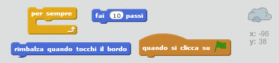
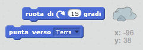
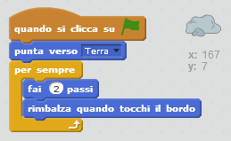

## Bouncing asteroid

Aggiungiamo un po' di rocce spaziali fluttuanti alla tua animazione.

+ Aggiungi lo sprite 'roccia' alla tua animazione.
    
    

+ Puoi aggiungere del codice per far sì che lo sprite della tua roccia rimbalzi nello spazio?
    
    

\--- hints \--- \--- hint \--- Dopo aver **cliccato su ⚑**, la tua roccia dovrebbe **muoversi** e **rimbalzare** nello spazio **per sempre**. \--- /hint \--- \--- hint \--- Ecco di quali blocchi di codice avrai bisogno:  Utilizza uno di questi blocchi per far partire la tua roccia da un punto migliore:  \--- /hint \--- \--- hint \--- Ecco quali blocchi di codice faranno rimbalzare la tua roccia nello spazio:  \--- /hint \--- \--- /hints \---