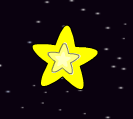
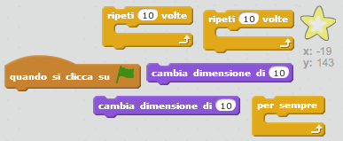
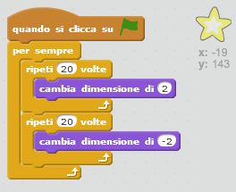

## Stella splendente

Combiniamo dei cicli per creare una stella che risplende.

+ Aggiungi lo sprite 'stella' alla tua animazione.
    
    

+ Puoi aggiungere del codice per far sì che la tua stella si ingrandisca e si rimpicciolisca ripetutamente?
    
    

\--- hints \--- \--- hint \--- Dopo aver **cliccato su ⚑**, la tua stella dovrebbe **cambiare dimensione** per un po', diventando più grande, e poi dovrebbe **cambiare di nuovo dimensione** per un po', diventando più piccola. Fai in modo che la stella si ingrandisca e rimpicciolisca **per sempre**. \--- /hint \--- \--- hint \--- Ecco di quali blocchi di codice avrai bisogno:  \--- /hint \--- \--- hint \--- Ecco il codice che farà splendere la tua stella:  \--- /hint \--- \--- /hints \---