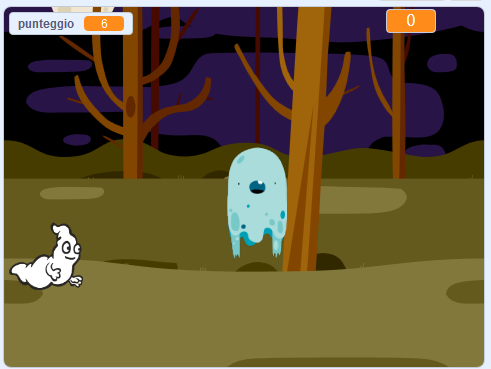

## E adesso?

Prova il progetto [Ghostbusters](https://projects.raspberrypi.org/it-IT/projects/ghostbusters?utm_source=pathway&utm_medium=whatnext&utm_campaign=projects)! In questo progetto, imparerai come creare un gioco con fantasmi che appaiono dappertutto e che devi catturare. Imparerai anche come aggiungere un timer e un punteggio al gioco, in modo da poter vedere quanti fantasmi riesci a catturare.

--- no-print ---

  <iframe allowtransparency="true" width="485" height="402" src="https://scratch.mit.edu/projects/embed/334699971/?autostart=false" frameborder="0" scrolling="no"></iframe>
  

--- /no-print ---

--- print-only ---

--- /print-only ---

***
Questo progetto è stato tradotto da volontari:

Alessandro Mandelli

Omar Lazzari

Grazie ai volontari, possiamo offrire alle persone di tutto il mondo la possibilità di imparare nella loro lingua. Puoi aiutarci a raggiungere più persone offrendoti come volontario per la traduzione - puoi trovare maggiori informazioni su [rpf.io/translate](https://rpf.io/translate).