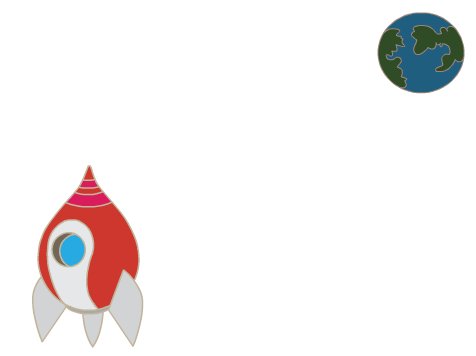
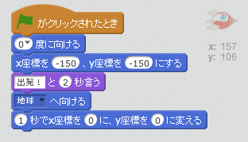

## 宇宙船 (うちゅうせん) のアニメーション

地球に向かって飛んでいく宇宙船をつくりましょう！

+ 新しいScratch (スクラッチ) のプロジェクトを開きましょう。

[[[generic-scratch-new-project]]]

+ 宇宙船と地球のスプライトをステージに追加してください。
    
    

[[[generic-scratch-sprite-from-library]]]

+ 背景 (はいけい) には「stars (星)」を追加してください。
    
    

[[[generic-scratch-backdrop-from-library]]]

+ 宇宙船をクリックして、コスチュームのタブをクリックしてください。
    
    

+ 選択 (せんたく) するには矢印 (やじるし)ツールを使います。丸い回転ハンドルをクリックして、横になるまで回転させます。
    
    

+ 宇宙船のスプライトにこのコードを追加しましょう。
    
    
    
    ブロックの中の数字を変えます。上にあるのとまったく同じようにしてください。
    
    緑の旗をクリックすると、宇宙船がしゃべり、回転し、ステージの中央に向かって進んでいきます。
    
    

[[[generic-scratch-saving]]]

--- challenge ---

## チャレンジ: アニメーションの改良（かいりょう）

アニメーションのコードの値 (あたい) を変えて、このようにできますか？

+ 宇宙船を地球にタッチするまで動かす
+ 宇宙船を地球に向かって、もっとゆっくり動かす

このブロックの値を変える必要があります。

[[[generic-scratch-coordinates]]]

--- /challenge ---