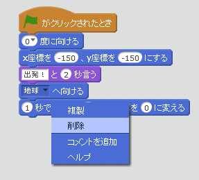
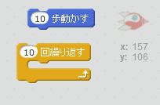
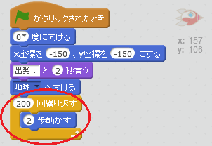
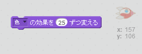
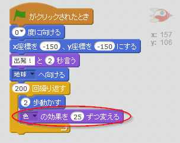
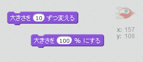
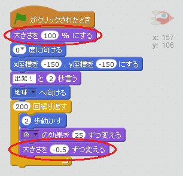

## 繰り返し (くりかえし) を使ったアニメーション

宇宙船を動かすには、別の方法もあります。それは何度も、少しずつ動くように宇宙船に教えることです。

+ 右クリックで削除 (さくじょ) を選んで、`変える`ブロックを消します。 スクリプトエリアからブロックエリアにブロックをドラッグして戻すことで、消すこともできます。
    
    

+ `繰り返す (くりかえす) ` ブロックを使って、宇宙船を地球に向けて動かせますか？
    
    テストして保存 (ほぞん) しましょう。宇宙船は前と同じように地球に向けて動きますが、今回は`繰り返す` ブロックを使います。
    
    

--- hints --- --- hint --- 変わるのではなく、 宇宙船は何度も少しずつ動きます。 --- /hint --- --- hint --- 必要なブロックは次の通りです。  --- /hint --- --- hint --- 宇宙船を動かすには、こうします。  (宇宙船がちゃんと地球に着くのなら、`繰り返す`ブロックと`動かす`ブロックにちがう値 (あたい) を入れて変えることもできます。 ) --- /hint --- --- /hints ---

+ コードを入れて、地球に向かっていく宇宙船の色を変えることができますか？
    
    テストして保存しましょう。
    
    

--- hints --- --- hint --- 宇宙船は動きながら、色を変えます。 --- /hint --- --- hint --- 新しく使うブロックはこちらです。  --- /hint --- --- hint --- 宇宙船の色を変えるには、こうします。  --- /hint --- --- /hints ---

+ 地球に近づくにつれて宇宙船を小さくしていくことができますか？
    
    テストして保存しましょう。宇宙船は近づくにつれて小さくなっていきます。2回目のテストをしましょう。宇宙船はちょうどいい大きさで始まりますか？
    
    

--- hints --- --- hint --- 宇宙船は100%の大きさで始まり、動くにつれて少しずつ大きさを変えます。 --- /hint --- --- hint --- 使うブロックはこちらです。  --- /hint --- --- hint --- 動く宇宙船の大きさを変えるには、こうします。  --- /hint --- --- /hints ---