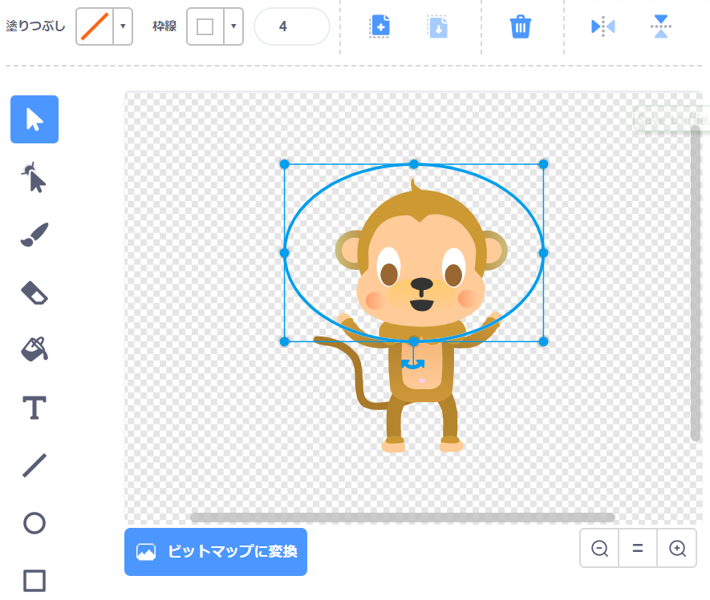
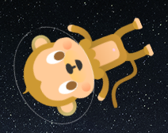
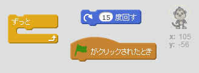
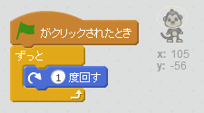

## ういているサル

宇宙で迷子 (まいご) になっているサルをアニメーションに追加しましょう！

+ ライブラリーからサルのスプライトを追加します。
    
    

+ サルのスプライトをクリックし、コスチュームをクリックします。サルの見え方を編集 (へんしゅう) できます。 楕円 (だえん) ツールをクリックして、サルの頭に白いヘルメットをかいてください。
    
    

+ コードを入れて、サルがゆっくりと回転し続けるようにできますか？
    
    テストして保存しましょう。このアニメーションを止めるためには、赤い停止ボタンをクリックしなければなりません。(クリックしないと、ずっと回転します。)
    
    

--- hints --- --- hint --- 緑の旗がクリックされたとき、 ずっとサルは回転し続けます。 --- /hint --- --- hint --- 使うブロックはこちらです。  --- /hint --- --- hint --- サルを回転するには、こうします。  --- /hint --- --- /hints ---