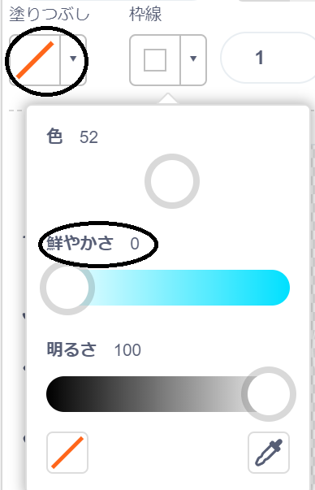

## ういているサル

宇宙で迷子（まいご）になっているサルをアニメーションに追加しましょう！

\--- task \--- ライブラリから「サル」スプライトを追加することから始めます。


\--- /task \---

新しいサルのスプライトをクリックし、**コスチューム**をクリックすると、サルの見えを編集できます。

\--- task \--- 赤い線を選択して、塗りつぶしを透明に設定します。アウトラインは、彩度スライダーを`0`に動かして白色に設定します 。

 \--- /task \---

\--- task \--- **円**ツールをクリックして、サルの頭の周りに白いスペースヘルメットを描きます。


\--- /task \---

\--- task \--- サルのスプライトにコードを追加して、ずっとゆっくりと円を描くように回転するようにできますか？

\--- hints \--- \--- hint \---

緑の**フラグがクリックされた**とき 、サルのスプライトは**ずっと**円を描くように**回転する**はずです 。

\--- /hint \--- \--- hint \---

必要なコードブロックは次のとおりです。

```blocks3
ずっと
end

↻ (15) 度回す

⚑ が押されたとき
```

\--- /hint \--- \--- hint \---

サルを回転させるコードは次のとおりです:


```blocks3
⚑ が押されたとき
ずっと 
  ↻ (1) 度回す
end
```

\--- /hint \--- \--- /hints \---

\--- /task \---

プロジェクトをテストして保存します。ずっと実行されるので、このアニメーションを終了させるために赤い**ストップ**ボタンをクリックする必要があります。

