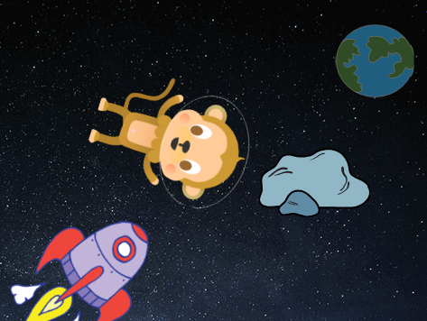
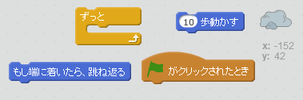
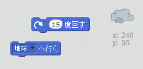
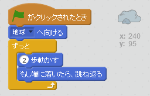

## はずむ小惑星 (しょうわくせい)

宇宙に浮かぶ岩をアニメーションに追加しましょう。

+ アニメーションに岩のスプライトを追加してください。
    
    

+ 岩のスプライトにコードを入れて、ステージ中をはね反るようにできますか？
    
    

--- hints --- --- hint --- 緑の旗がクリックされたとき、 ずっと岩のスプライトは動き、ステージ中をはずみます。 --- /hint --- --- hint --- 使うブロックはこちらです。  どちらかのブロックを使って、岩の最初の行き先を変えることもできます。  --- /hint --- --- hint --- 岩がステージ中をはね返るようにするには、こうします。  --- /hint --- --- /hints ---