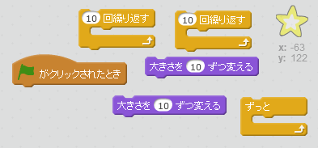
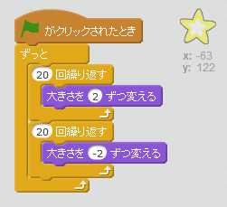

## 光る星

光る星を作るために、繰り返しを組み合わせましょう。

+ 星のスプライトをアニメーションに追加してください。
    
    

+ コードを入れて、星を何度も大きくしたり、小さくしたりできますか？
    
    

--- hints --- --- hint --- 緑の旗がクリックされたとき、星のスプライトは大きさを変えて何度か大きくなり、また大きさを変えて何度か小さくなります。 星はずっと大きく、そして小さくなります。 --- /hint --- --- hint --- 使うブロックはこちらです。  --- /hint --- --- hint --- 星を光らせるには、こうします。  --- /hint --- --- /hints ---