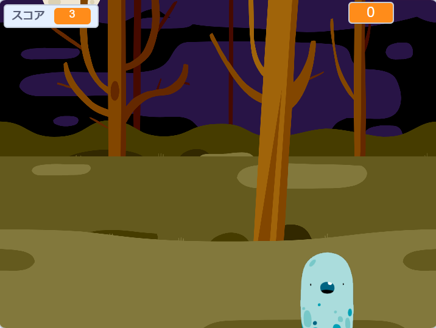

## 次は何？

[ゴーストバスターズ](https://projects.raspberrypi.org/ja-JP/projects/ghostbusters?utm_source=pathway&utm_medium=whatnext&utm_campaign=projects)プロジェクトをお試しください！ このプロジェクトでは、ゴーストがあちこちに出現し、捕まえるゲームを作成する方法を学びます。 ゲームにタイマーとスコアを追加する方法も学習します。これにより、捕まえられるゴーストの数を確認できます。

--- no-print ---

  <iframe allowtransparency="true" width="485" height="402" src="https://scratch.mit.edu/projects/embed/276874679/?autostart=false" frameborder="0" scrolling="no"></iframe>
  

--- /no-print ---

--- print-only ---

--- /print-only ---

***
コミュニティによる翻訳

このプロジェクトの翻訳は 斉藤友明/松原慧子、レビューは 関谷 武一郎/益本玲奈 が行いました。 

すばらしい翻訳ボランティアは、世界中の子供たちにコーディングを学ぶチャンスを与えるのに役立っています。私たちのプロジェクトを翻訳することにより、より多くの子供たちにプログラミングを学んでもらう事ができます。詳しくは[rpf.io/translate](https://rpf.io/translate)をご覧ください。
