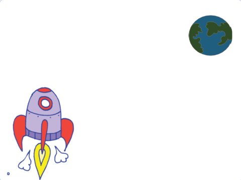
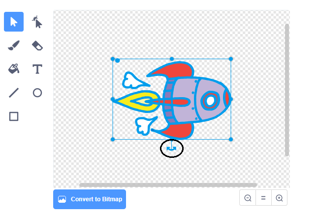

## ಆಕಾಶನೌಕೆ ಅನಿಮೇಷನ್ ಮಾಡುವುದು

ನಿಮ್ಮ ಮೊದಲ ಹೆಜ್ಜೆ ಭೂಮಿಯ ಕಡೆಗೆ ಹಾರುವ ಆಕಾಶನೌಕೆ ರಚಿಸುವುದು!

--- task ---

ಹೊಸದನ್ನು ತೆರೆಯಿರಿ Scratch ಯೋಜನೆ.

**Online:** ಹೊಸ ಆನ್‌ಲೈನ್ ತೆರೆಯಿರಿ Scratch ನಲ್ಲಿ ಯೋಜನೆ [rpf.io/scratch-new](https://rpf.io/scratchon){:target="_blank"}.

**Offline:** ಆಫ್‌ಲೈನ್ ಸಂಪಾದಕದಲ್ಲಿ ಹೊಸ ಯೋಜನೆಯನ್ನು ತೆರೆಯಿರಿ.

ನಿಮಗೆ ಅಗತ್ಯವಿದ್ದರೆ ಡೌನ್ಲೋಡ್ ಮತ್ತು ಇನ್ಸ್ಟಾಲ್ Scratch offline editor, ನೀವು ಅದನ್ನು ಕಾಣಬಹುದು [rpf.io/scratchoff](https://rpf.io/scratchoff){:target="_blank"}.

--- /task ---

--- task ---

ನಿಮ್ಮ ಹಂತಕ್ಕೆ 'rocketship' (ರಾಕೆಟ್‌ಶಿಪ್) ಮತ್ತು 'Earth' (ಭೂಮಿ) ಸ್ಪ್ರೈಟ್‌ಗಳನ್ನು ಸೇರಿಸಿ.



[[[generic-scratch3-sprite-from-library]]]

--- /task ---

--- task ---

ನಿಮ್ಮ ಹಂತಕ್ಕೆ 'Stars' (ನಕ್ಷತ್ರಗಳು) ಬ್ಯಾಕ್‌ಡ್ರಾಪ್ ಸೇರಿಸಿ.


--- /task ---

--- task ---

ನಿಮ್ಮ ಆಕಾಶನೌಕೆ ಸ್ಪ್ರೈಟ್ ಮೇಲೆ ಕ್ಲಿಕ್ ಮಾಡಿ, ಮತ್ತು **Costumes** ಟ್ಯಾಬ್ ಮೇಲೆ ಕ್ಲಿಕ್ ಮಾಡಿ.


--- /task ---

--- task ---

ಇಡೀ ಆಕಾಶನೌಕೆ ಚಿತ್ರದ ಸುತ್ತಲೂ ಪೆಟ್ಟಿಗೆಯನ್ನು ಬರೆಯಲು **arrow**ವನ್ನು ಕ್ಲಿಕ್ ಮಾಡಿ ಮತ್ತು ಎಳೆಯಿರಿ. ನಂತರ **rotate** ಮೇಲೆ ಕ್ಲಿಕ್ ಮಾಡಿ ಮತ್ತು ಚಿತ್ರವನ್ನು ತಿರುಗಿಸಿ.



--- /task ---

--- task ---

ನಿಮ್ಮ ಆಕಾಶನೌಕೆ ಸ್ಪ್ರೈಟ್‌ಗೆ ಈ ಕೋಡ್ ಸೇರಿಸಿ:


```blocks3
when flag clicked
point in direction (0)
go to x:(-150) y:(-150)
say [Let's go] for (2) seconds
point towards (Earth v)
glide (1) secs to x:(0) y:(0)
```

ನೀವು ಸೇರಿಸಿದ ಕೋಡ್ ಬ್ಲಾಕ್‌ಗಳಲ್ಲಿನ ಸಂಖ್ಯೆಗಳನ್ನು ಬದಲಾಯಿಸಿ. ಕೋಡನ್ನು ಮೇಲಿನಂತೆ ಮಾಡಿ.

--- /task ---

ನೀವು ಹಸಿರು ಧ್ವಜವನ್ನು ಕ್ಲಿಕ್ ಮಾಡಿದರೆ, ಆಕಾಶನೌಕೆ ಮಾತನಾಡುವುದು, ತಿರುಗುವುದು ಮತ್ತು ವೇದಿಕೆಯ ಮಧ್ಯಭಾಗಕ್ಕೆ ತಿರುಗುವುದು ನೀವು ನೋಡಬಹುದು.


