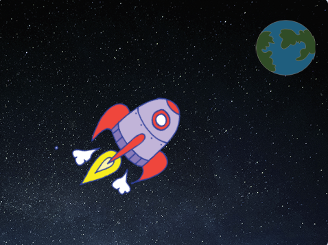

## ಆಕಾಶನೌಕೆ ಅನಿಮೇಷನ್ ಮಾಡುವುದು

ನಿಮ್ಮ ಮೊದಲ ಹೆಜ್ಜೆ ಭೂಮಿಯ ಕಡೆಗೆ ಹಾರುವ ಆಕಾಶನೌಕೆ ರಚಿಸುವುದು!

\--- task \---

ಹೊಸ ಸ್ಕ್ರ್ಯಾಚ್ ಯೋಜನೆಯನ್ನು ತೆರೆಯಿರಿ.

** ಆನ್‌ಲೈನ್: ** [ rpf.io/scratch-New ನಲ್ಲಿ ಹೊಸ ಆನ್‌ಲೈನ್ ಸ್ಕ್ರ್ಯಾಚ್ ಯೋಜನೆಯನ್ನು ತೆರೆಯಿರಿ ](http://rpf.io/scratchon) {:target="_blank"}.

** ಆಫ್‌ಲೈನ್: ** ಆಫ್‌ಲೈನ್ ಸಂಪಾದಕದಲ್ಲಿ ಹೊಸ ಯೋಜನೆಯನ್ನು ತೆರೆಯಿರಿ.

ನೀವು ಸ್ಕ್ರ್ಯಾಚ್ ಆಫ್‌ಲೈನ್ ಸಂಪಾದಕವನ್ನು ಡೌನ್‌ಲೋಡ್ ಮಾಡಿ ಸ್ಥಾಪಿಸಬೇಕಾದರೆ, ನೀವು ಅದನ್ನು [ rpf.io/scratchoff ನಲ್ಲಿ ಕಾಣಬಹುದು ](http://rpf.io/scratchoff) {:target="_blank"}.

\--- /task \---

\--- task \---

ನಿಮ್ಮ ಹಂತಕ್ಕೆ 'ರಾಕೆಟ್‌ಶಿಪ್' ಮತ್ತು 'ಭೂಮಿ' ಸ್ಪ್ರೈಟ್‌ಗಳನ್ನು ಸೇರಿಸಿ.


[[[generic-scratch3-sprite-from-library]]]

\--- /task \---

\--- task \---

ನಿಮ್ಮ ಹಂತಕ್ಕೆ 'ನಕ್ಷತ್ರಗಳು' ಬ್ಯಾಕ್‌ಡ್ರಾಪ್ ಸೇರಿಸಿ.


\--- /task \---

\--- task \---

ನಿಮ್ಮ ಆಕಾಶನೌಕೆ ಸ್ಪ್ರೈಟ್ ಮೇಲೆ ಕ್ಲಿಕ್ ಮಾಡಿ, ಮತ್ತು ** ವೇಷಭೂಷಣಗಳ** ಟ್ಯಾಬ್ ಮೇಲೆ ಕ್ಲಿಕ್ ಮಾಡಿ.


\--- /task \---

\--- task \---

ಇಡೀ ಆಕಾಶನೌಕೆ ಚಿತ್ರದ ಸುತ್ತಲೂ ಪೆಟ್ಟಿಗೆಯನ್ನು ಬರೆಯಲು ** ಬಾಣ**ವನ್ನು ಕ್ಲಿಕ್ ಮಾಡಿ ಮತ್ತು ಎಳೆಯಿರಿ. ನಂತರ ** ವೃತ್ತಾಕಾರದ ** ಮೇಲೆ ಕ್ಲಿಕ್ ಮಾಡಿ ಮತ್ತು ಚಿತ್ರವನ್ನು ತಿರುಗಿಸಿ.


\--- /task \---

\--- task \---

Add this code to your spaceship sprite:


```blocks3
when flag clicked
point in direction (0)
go to x:(-150) y:(-150)
say [Let's go] for (2) seconds
point towards (Earth v)
glide (1) secs to x:(0) y:(0)
```

Change the numbers in the code blocks you've added so that the code is exactly the same as above.

\--- /task \---

If you click the green flag, you should see the spaceship speak, turn, and glide towards the centre of the stage.

