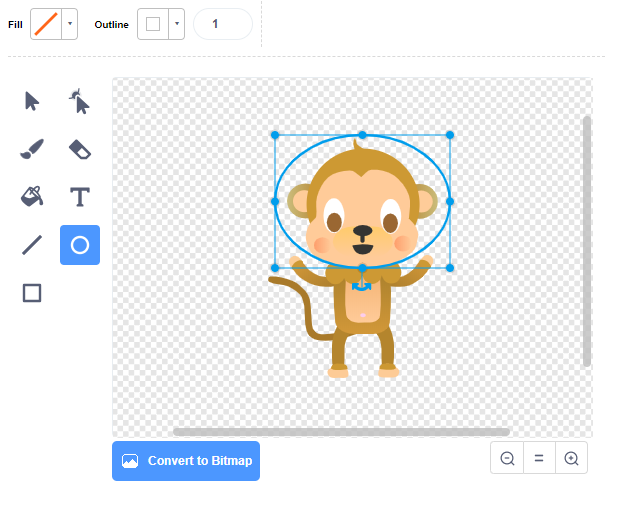

## ತೇಲುವ ಮಂಗ

ನಿಮ್ಮ ಅನಿಮೇಷನ್‌ಗೆ ಆಕಾಶದಲ್ಲಿ ಕಳೆದುಹೋದ ಮಂಗವನ್ನು ಈಗ ನೀವು ಸೇರಿಸುತ್ತೀರಿ!

\--- task \---

ಲೈಬ್ರರಿಯಿಂದ 'monkey (ಮಂಗ)' ಸ್ಪ್ರೈಟ್ ಅನ್ನು ಸೇರಿಸುವ ಮೂಲಕ ಪ್ರಾರಂಭಿಸಿ.


\--- /task \---

ನಿಮ್ಮ ಹೊಸ ಮಂಗ ಸ್ಪ್ರೈಟ್ ಮೇಲೆ ಕ್ಲಿಕ್ ಮಾಡಿ ಮತ್ತು ನಂತರ **Costumes** ಮೇಲೆ ಕ್ಲಿಕ್ ಮಾಡಿ. ಇದರಿಂದಾಗಿ ಕೋತಿ ಹೇಗೆ ಕಾಣುತ್ತದೆ ಎಂಬುದನ್ನು ನೀವು ಸಂಪಾದಿಸಬಹುದು.

\--- task \---

ಕೆಂಪು ರೇಖೆಯನ್ನು ಆರಿಸುವ ಮೂಲಕ ಫಿಲ್ ಅನ್ನು ಪಾರದರ್ಶಕವಾಗಿರಲು ಹೊಂದಿಸಿ. ಬಾಹ್ಯರೇಖೆಗಾಗಿ, ಸ್ಯಾಚುರೇಶನ್ ಸ್ಲೈಡರ್ ಅನ್ನು ` 0` ಗೆ ಸರಿಸುವ ಮೂಲಕ ಬಿಳಿ ಬಣ್ಣವನ್ನು ಹೊಂದಿಸಿ.


\--- /task \---

\--- task \---

**circle** ಉಪಕರಣದ ಮೇಲೆ ಕ್ಲಿಕ್ ಮಾಡಿ ಮತ್ತು ನಂತರ ಅದನ್ನು ಕೋತಿಯ ತಲೆಯ ಸುತ್ತ ಬಿಳಿ ಆಕಾಶ ಹೆಲ್ಮೆಟ್ ಅನ್ನು ಬರೆಯಲು ಬಳಸಿ.



\--- /task \---

\--- task \---

ನಿಮ್ಮ ಮಂಕಿ ಸ್ಪ್ರೈಟ್‌ಗೆ ಕೋಡ್ ಅನ್ನು ಸೇರಿಸಬಹುದೇ ಇದರಿಂದ ಅದು ವೃತ್ತದಲ್ಲಿ ನಿಧಾನವಾಗಿ ಶಾಶ್ವತವಾಗಿ ತಿರುಗುತ್ತದೆ?

\--- hints \--- \--- hint \---

ಹಸಿರು ** ಧ್ವಜವನ್ನು ಕ್ಲಿಕ್ ಮಾಡಿದಾಗ **, ನಿಮ್ಮ ಮಂಕಿ ಸ್ಪ್ರೈಟ್ ** ಶಾಶ್ವತವಾಗಿ ವಲಯದಲ್ಲಿ ** ** ತಿರುಗಬೇಕು **.

\--- /hint \--- \--- hint \---

ನಿಮಗೆ ಅಗತ್ಯವಿರುವ ಕೋಡ್ ಬ್ಲಾಕ್‌ಗಳು ಇಲ್ಲಿವೆ:

```blocks3
forever
end

turn cw (15) degrees

when flag clicked
```

\--- /hint \--- \--- hint \---

ನಿಮ್ಮ ಮ೦ಗ ಸ್ಪಿನ್ ಮಾಡಲು ಕೋಡ್ ಇಲ್ಲಿದೆ:


```blocks3
when flag clicked
forever
    turn cw (1) degrees
```

\--- /hint \--- \--- /hints \---

\--- /task \---

ನಿಮ್ಮ ಯೋಜನೆಯನ್ನು ಪರೀಕ್ಷಿಸಿ ಮತ್ತು ಉಳಿಸಿ. ಅದು ಶಾಶ್ವತವಾಗಿ ಚಲಿಸುತ್ತದೆ! ಈ ಅನಿಮೇಷನ್ ಅನ್ನು ಕೊನೆಗೊಳಿಸಲ, ನೀವು ಕೆಂಪು ** stop ** ಬಟನ್ ಅನ್ನು ಕ್ಲಿಕ್ ಮಾಡಬೇಕಾಗುತ್ತದೆ.

