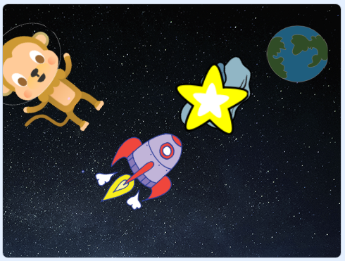

\--- no-print \---

이것은 **스크래치 3** 버전의 프로젝트예요. [스크래치 2 버전의 프로젝트](https://projects.raspberrypi.org/en/projects/lost-in-space-scratch2)도 있어요.

\--- /no-print \---

## 들어가며

너만의 애니매이션을 프로그래밍하는 방법을 배울 거야!

### 만들게 될 것

\--- no-print \---

초록색 깃발을 클릭해 애니매이션을 보세요.

  <iframe allowtransparency="true" width="485" height="402" src="https://scratch.mit.edu/projects/embed/276873231/?autostart=false" frameborder="0" scrolling="no"></iframe>
  

\--- /no-print \---

\--- print-only \---

\--- /print-only \---

## \--- collapse \---

## title: 준비물

### 하드웨어

- 스크래치 3을 실행할 수 있는 컴퓨터

### 소프트웨어

- 스크래치 3 ([온라인](http://rpf.io/scratchon){:target="_ blank"} 또는 [offline](http://rpf.io/scratchoff){:target="_ blank"})

### 다운로드

- 없음

\--- /collapse \---

## \--- collapse \---

## title: 배우게 될 것

- 반복 루프를 사용하여 스크래치에서 스프라이트 움직이기
- 무한 반복하기를 사용하여 애니메이션을 계속 반복하기
- 반복하기가 중첩될 수 있음을 이해하기

\--- /collapse \---

## \--- collapse \---

## title: 교육자를 위한 추가 정보

이 프로젝트를 인쇄하려면, [프린트용 버전](https://projects.raspberrypi.org/en/projects/lost-in-space/print){:target="_blank"}을 사용하세요.

여기서 [완료된 프로젝트](http://rpf.io/p/en/lost-in-space-get){:target="_blank"}.를 확인할 수 있습니다

\--- /collapse \---